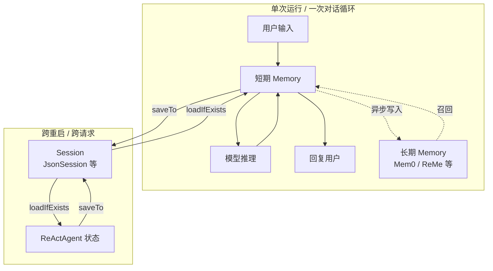
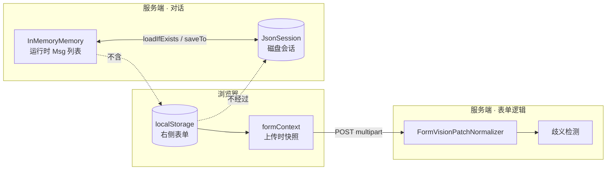
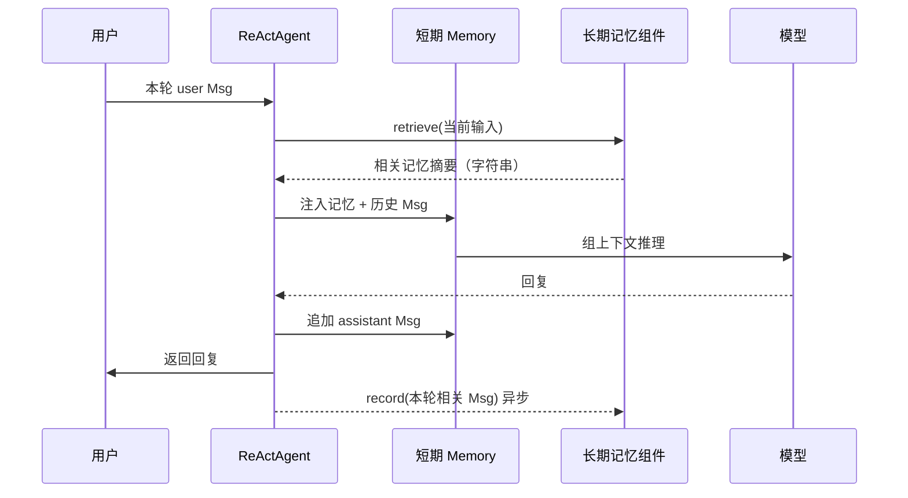

# AgentScope Java：Memory 与 Session

本文档面向 **multimodal-demo** 团队 onboarding，说明 AgentScope Java 中 **Memory** 与 **Session** 的分工与协作，并补充本项目中 **JsonSession**、**InMemoryMemory**、**前端 localStorage**、**formContext** 的对照关系。

官方参考：

- [记忆 (Memory)](https://java.agentscope.io/zh/task/memory.html)
- [Session（会话管理）](https://java.agentscope.io/zh/task/session.html)

---

## 一、Memory 与 Session：一句话区分

| 概念 | 是什么 | 类比 |
|------|--------|------|
| **Memory（记忆）** | Agent **脑子里**的对话内容与上下文 | 笔记本上的聊天记录 |
| **Session（会话）** | 把 Agent、Memory 等状态 **存到磁盘/数据库** 的机制 | 带编号的档案柜（按 `sessionId` 分格） |

**关键关系**：短期记忆（`InMemoryMemory` 等）本身只在内存里；要想**重启应用后还能接着聊**，必须把 Memory（以及 Agent 自身状态）通过 **Session** 持久化。

长期记忆（Mem0、ReMe 等）则**不依赖 Session**，由外部服务自己持久化。

---

## 二、架构总览



- **Memory**：负责「这次对话里模型能看到什么」。
- **Session**：负责「这次对话结束后，下次还能不能恢复」。
- **长期 Memory**：跨很多个 Session / 很多天，由外部组件管，和 Session 是另一条线。

---

## 三、Memory：管什么、不管什么

### 3.1 两类记忆

| 类型 | 作用范围 | 谁持久化 |
|------|----------|----------|
| **短期记忆** | 当前会话的多轮 `Msg` 列表 | **要配合 Session**（或进程不重启则只在内存） |
| **长期记忆** | 跨会话的用户偏好、事实 | **外部服务**（Mem0 API、ReMe、百炼记忆库等），框架自动 `record` / `retrieve` |

### 3.2 短期记忆的常见实现

1. **`InMemoryMemory`**（默认、最简单）
   - 内存里堆消息，会越积越多。
   - 适合短对话、Demo。
   - 本项目中 `DemoChatService`、`FormVisionStreamService` 均使用它。

2. **`AutoContextMemory`**
   - 超长对话时自动压缩、摘要、卸载大内容。
   - 仍属短期记忆，持久化同样要靠 Session。

### 3.3 Memory 接口

```java
public interface Memory extends StateModule {
    void addMessage(Msg message);   // 记一条消息
    List<Msg> getMessages();        // 给模型当上下文
    void deleteMessage(int index);
    void clear();
}
```

`Memory` 继承 `StateModule` → 说明它的内容**可以被序列化**，这正是 Session 能保存它的前提。

### 3.4 长期记忆在 Agent 里的位置

- 推理前：`retrieve` 把相关长期记忆**注入短期 Memory**。
- 回复后：`record` 把本轮对话**异步写入** Mem0 等。
- 模式：`STATIC_CONTROL`（框架自动）/ `AGENT_CONTROL`（Agent 用工具自己记）/ `BOTH`。

长期记忆**不需要**手动 `saveTo`；Session **管不到** Mem0 里的向量库。

---

## 四、Session：管什么、不管什么

### 4.1 Session 解决什么问题

- 用户关掉浏览器、服务重启、第二天再打开 → 还能加载**同一个 `sessionId`** 下的历史。
- 持久化的不只是 Memory，还有 **Agent 自身状态**（如迭代次数、计划本等，若注册了相应 `StateModule`）。

### 4.2 常见实现

| 实现 | 存储 | 场景 |
|------|------|------|
| **`JsonSession`** | 文件系统 `{root}/{sessionId}/` | 生产、本项目默认方式 |
| **`InMemorySession`** | 进程内存 | 单测、临时 |

### 4.3 磁盘目录结构（JsonSession）

```
data/agentscope-sessions/
└── {sessionId}/                    ← 须经 SessionIds 安全校验
    ├── memory_messages.jsonl       ← 短期记忆：每行一条 Msg
    ├── agent_meta.json             ← Agent 等状态
    ├── toolkit_activeGroups.json
    └── upload_material_coverage.json
```

- 单值状态 → `{key}.json`
- 列表状态（如消息列表）→ `{key}.jsonl`（JSONL，便于追加）

### 4.4 核心 API（推荐写法）

```java
Session session = new JsonSession(sessionPath);

agent.loadIfExists(session, sessionId);  // 有则恢复，无则跳过
// ... agent.call(...) ...
agent.saveTo(session, sessionId);      // 把 Agent + Memory 等写入磁盘
```

`saveTo` / `loadIfExists` 挂在 **Agent** 上，内部会把已注册的 `StateModule`（含 Memory）交给 Session 读写。

---

## 五、二者关系：谁依赖谁

```
┌─────────────────────────────────────────────────────────┐
│  ReActAgent                                              │
│  ├─ memory: InMemoryMemory  ←── 运行时读写对话历史        │
│  └─ longTermMemory: Mem0?   ←── 可选，走外部 API          │
└─────────────────────────────────────────────────────────┘
         │ loadIfExists / saveTo
         ▼
┌─────────────────────────────────────────────────────────┐
│  Session (JsonSession)                                   │
│  sessionId → 目录/键空间，存 Memory 消息 + Agent 状态     │
└─────────────────────────────────────────────────────────┘
```

要点：

1. **Memory 是内容；Session 是存放内容的仓库。**
2. **短期 Memory 不会自动落盘**，必须显式 `saveTo`。
3. **长期 Memory 不经过 Session**，通常用 `userId` 等区分用户。
4. **一个 `sessionId` 通常对应一条短期对话线**；长期记忆可横跨多个 sessionId。

---

## 六、本项目中的一次请求生命周期

### 6.1 文本聊天 `POST /api/sessions/{id}/messages`

```
1. sessionId 来自 URL
2. new InMemoryMemory() + ReActAgent(...).memory(memory)
3. agent.loadIfExists(jsonSession, sessionId)  → 恢复 memory_messages.jsonl
4. agent.call(用户文本)                        → Memory 追加 Msg
5. agent.saveTo(jsonSession, sessionId)
6. 返回 form_patch；前端 setFieldsValue + localStorage.persistForm()
```

入口：`DemoChatService.java`

### 6.2 多图视觉 `POST /api/sessions/{id}/vision/form-stream`（SSE）

```
1. 前端 serializeFormContextForVision(getFieldsValue()) → multipart formContext
2. agent.loadIfExists(jsonSession, sessionId)
3. agent.call(图片 + 提示)
4. FormVisionPatchNormalizer + FormVisionMultiEntityConflictDetector（合并 formContext）
5. SSE result：formPatch、ambiguities
6. agent.saveTo(jsonSession, sessionId)
7. 前端 setFieldsValue + persistForm()
```

入口：`FormVisionStreamService.java`、`App.tsx`

---

## 七、multimodal-demo：四态对照（Onboarding）

同一条业务线里，**对话记忆**、**表单数据**、**跨轮歧义** 由四套机制分担，不要混为一谈。

### 7.1 总览图



### 7.2 对照表

| 维度 | **JsonSession** | **InMemoryMemory** | **前端 localStorage** | **formContext** |
|------|-----------------|--------------------|-----------------------|-----------------|
| **是什么** | AgentScope 会话持久化（磁盘仓库） | Agent 短期对话记忆（内存里的 `Msg` 列表） | 浏览器里右侧 Ant Design 表单的草稿 | 单次视觉上传时附带的「当前表单」JSON 快照 |
| **存什么** | `memory_messages.jsonl`、`agent_meta.json` 等 | 用户/助手消息、推理上下文 | `companyName`、`safetyLicenseNo` 等 camelCase 字段 | 与 localStorage 同结构的一帧 JSON |
| **存在哪** | `data/agentscope-sessions/{sessionId}/` | JVM 堆（每请求 new，再 load） | `localStorage["multimodal-demo:form:" + sessionId]` | 不持久化；仅当次 multipart |
| **谁读写** | `agent.saveTo` / `agent.loadIfExists` | `ReActAgent.call()` | `persistForm()` / 页面 `useEffect` | `serializeFormContextForVision()` → `FormVisionFormContextSupport` |
| **生命周期** | 跨重启、跨多次 HTTP | 单次请求内；结束靠 Session 落盘 | 换浏览器/清缓存会丢 | 仅该次上传请求 |
| **绑定键** | API 的 `sessionId` | 当前 Agent 实例 | 同上 `sessionId` | 同上 `sessionId` |
| **典型用途** | 多轮聊天、视觉 Agent 记历史 | 模型对话上下文 | 填表、刷新不丢 | 第二轮上传时把已填 **A** 与本轮 **B/C** 合并歧义 |
| **是否给 LLM** | 间接（load 进 Memory 后才是） | **是** | **否** | **否**（只给规则引擎） |
| **是否等于右侧表单** | **否** | **否** | **是** | 表单的**一次性副本** |

### 7.3 同一 sessionId 的心智模型

```
sessionId
    ├─ JsonSession/              ← 服务端：对话档案柜（聊了什么）
    ├─ localStorage 键           ← 浏览器：表单草稿本（填了什么）
    ├─ InMemoryMemory            ← 每请求临时打开聊天记录，save 回 JsonSession
    └─ formContext               ← 上传瞬间复印草稿本给后端（不写 JsonSession）
```

**口诀**：聊什么 → Memory + JsonSession；填什么 → localStorage；上传要考虑已填什么 → formContext。

### 7.4 多轮上传示例

| 轮次 | localStorage | formContext（当次） | InMemoryMemory / JsonSession |
|------|--------------|---------------------|------------------------------|
| 1 上传营业执照 | `companyName = A` | 可带 `{ companyName: A, ... }` | 记录上传与识别相关 Msg |
| 2 上传两张许可证 | 仍含 A 及证号等 | **整表快照**（含 A） | 追加第二轮 Msg |
| 歧义 UI | 点选后更新 localStorage | 已消费 | 对话历史仍有第二轮记录 |

歧义里的 **「已填报（当前表单）」** 来自 **formContext**，不是 JsonSession。

### 7.5 新人易错点

| 误解 | 实际情况 |
|------|----------|
| Session 里能读到右侧表单 | 不能；磁盘只有对话与 Agent 状态 |
| 清了 localStorage 对话还在 | 对话在 JsonSession；表单没了 |
| formContext 会替代 localStorage | 不会；只影响当次识别；结果仍写回 localStorage |
| 换电脑同一 sessionId 表单还在 | 表单在浏览器；对话在服务端 |
| InMemoryMemory 跨请求共享 | 不共享；靠同一 sessionId + load/save 延续 |

### 7.6 配置速查

| 项 | 值 |
|----|-----|
| Session 根目录 | `agentscope.session-root`，默认 `data/agentscope-sessions` |
| localStorage 键前缀 | `multimodal-demo:form:` |
| multipart 字段 | `files`（图）、`formContext`（可选 JSON） |

### 7.7 相关源码

| 机制 | 文件 |
|------|------|
| JsonSession Bean | `src/main/java/.../config/AgentscopeSessionConfig.java` |
| 文本聊天 | `src/main/java/.../service/DemoChatService.java` |
| 视觉 SSE | `src/main/java/.../service/FormVisionStreamService.java` |
| formContext 解析 | `src/main/java/.../service/FormVisionFormContextSupport.java` |
| 前端表单 / formContext | `frontend/src/App.tsx`、`frontend/src/api.ts` |
| sessionId 安全 | `src/main/java/io/agentscope/demo/SessionIds.java` |

---

## 八、选型建议

| 需求 | 用什么 |
|------|--------|
| 只要当前请求内多轮上下文 | `InMemoryMemory`，可不 save |
| 同一用户隔天继续聊、服务重启不丢 | `InMemoryMemory` + `JsonSession` + 固定 `sessionId` |
| 对话特别长、要控 Token | `AutoContextMemory` + Session |
| 记住用户爱好、跨很多天很多会话 | `Mem0LongTermMemory` 等，不靠 Session 存长期内容 |
| 多实例部署共享会话 | 自定义 `Session`（MySQL/Redis），见官方 Session 文档 |

---

## 九、常见误解（AgentScope 通用）

1. **「有了 Session 就不需要 Memory」** — 错。Session 只负责存取；没有 Memory，Agent 没有对话历史。
2. **「Memory 会自动持久化」** — 短期 Memory 不会；必须 `saveTo`。长期 Memory 由外部服务持久化。
3. **「Session 里存的就是前端表单」** — 在本项目中不是；表单在 localStorage + 视觉链路的 formContext。

---

## 十、Session API 迁移说明

新版推荐 `agent.saveTo(session, id)` / `agent.loadIfExists(session, id)`，与旧版 `SessionManager` 单文件 JSON **格式不兼容**。本项目已使用新 API。

迁移与安全说明见官方：[Session（会话管理）](https://java.agentscope.io/zh/task/session.html) 中的「数据格式与迁移」「安全提示」章节。

---

## 十一、长期记忆（Long-term Memory）

长期记忆解决的是：**换了一个 `sessionId`、隔天再来、甚至换了一台机器**，Agent 仍能否记住「这个人是谁、偏好什么、以前说过什么重要事实」。它和 **短期记忆 + Session** 是两条线，不要混用。

官方文档：[记忆 (Memory)](https://java.agentscope.io/zh/task/memory.html) 中「长期记忆」章节。

### 11.1 和短期记忆、Session 怎么分工

| | **短期记忆** | **长期记忆** | **Session（JsonSession）** |
|--|-------------|-------------|---------------------------|
| **记什么** | 当前会话完整/压缩后的对话 `Msg` | 提炼后的**事实、偏好、用户画像** | 短期 Memory + Agent 状态的**落盘副本** |
| **范围** | 通常绑定一个 `sessionId` 的一条对话线 | 绑定 **`userId`**（等），可跨很多 session | 按 `sessionId` 分目录 |
| **给谁用** | 每次 `call` 时整段（或压缩后）塞进 LLM 上下文 | 先 **retrieve** 成一小段文字，再注入短期记忆 | 不负责「理解」，只负责存取 |
| **持久化** | 要靠 `saveTo` / Session | **外部服务自动持久化**（向量库等） | 文件/DB |
| **典型问题** | 「上一轮你说了什么？」 | 「这个用户是不是素食？上次说过住在北京？」 | 「服务重启后这次聊天还能接上吗？」 |

**multimodal-demo 现状**：只用 `InMemoryMemory` + `JsonSession`，**没有接长期记忆**（业务表单在浏览器 `localStorage`，也不是长期记忆）。

### 11.2 在 ReActAgent 里怎么跑



要点：

1. **retrieve（推理前）** — 根据当前用户输入做语义检索，返回**已整理好的文字**（不是聊天记录全文）。
2. **record（回复后，常异步）** — 本轮对话经 LLM 抽取/总结后写入外部记忆库；**不要**对 Mem0 调 `saveTo`。
3. **跨 session** — `sessionId` 变了，只要 `userId` 相同，仍可能召回同一用户的长期记忆。

### 11.3 接口：`LongTermMemory`

```java
public interface LongTermMemory {
  Mono<Void> record(List<Msg> msgs);   // 回复后写入/更新
  Mono<String> retrieve(Msg msg);     // 推理前检索，返回注入上下文的文本
}
```

短期 `Memory` 管 **Msg 列表**；长期记忆管 **跨会话知识**，二者接口不同。

### 11.4 工作模式：`LongTermMemoryMode`

| 模式 | 行为 |
|------|------|
| **`STATIC_CONTROL`** | 每轮自动 retrieve → 推理 → 自动 record（最常用） |
| **`AGENT_CONTROL`** | 通过 Tool 由 Agent 自行决定何时查/记记忆 |
| **`BOTH`** | 自动 + 工具同时启用 |

```java
Mem0LongTermMemory longTerm = Mem0LongTermMemory.builder()
    .agentName("SmartAssistant")
    .userId("user-001")              // 跨 session 主键，比 sessionId 更适合长期记忆
    .apiKey(System.getenv("MEM0_API_KEY"))
    .apiBaseUrl("https://api.mem0.ai")
    .build();

ReActAgent agent = ReActAgent.builder()
    .name("Assistant")
    .model(model)
    .memory(new InMemoryMemory())
    .longTermMemory(longTerm)
    .longTermMemoryMode(LongTermMemoryMode.STATIC_CONTROL)
    .build();
```

### 11.5 三种常见实现

#### Mem0 — `Mem0LongTermMemory`

- 对接 Mem0 云端或自建；Maven：`agentscope-extensions-mem0`（本 demo 为精简依赖已移除）。
- **Platform**（`api.mem0.ai`）与 **自建**（`SELF_HOSTED`）API 路径不同，须设 `apiType`。
- 关键：`userId`、`agentName`、`apiKey`、`apiBaseUrl`。

```bash
export MEM0_API_KEY=your_key
export MEM0_API_BASE_URL=https://api.mem0.ai   # 自建时为 http://localhost:8000
export MEM0_API_TYPE=self-hosted               # 自建时
```

#### ReMe — `ReMeLongTermMemory`

- 对接 ReMe 服务，默认 `http://localhost:8002`。
- 关键：`userId`、`apiBaseUrl`。

#### 百炼 — `BailianLongTermMemory`

- 阿里云百炼记忆库 / 用户画像，与 DashScope 体系统一。
- 关键：`apiKey`、`userId`、`memoryLibraryId`、`projectId`、`profileSchema` 等（控制台配置）。

### 11.6 内部在做什么（排障用）

```
原始对话 Msg
  → LLM 抽取事实（偏好、地点、身份等）
  → 向量化 / 写入外部库
  → retrieve 按 userId + 语义相似度召回
  → 合并为短文本注入短期 Memory，再调主模型
```

- **不是**把 `memory_messages.jsonl` 全量同步到长期库。
- **record 可能异步**，不能假设「说完立刻 retrieve 得到」。

### 11.7 与本项目（multimodal-demo）的关系

```
用户维度（长期）              会话维度（短期）                 业务表单（前端）
userId → Mem0/ReMe/百炼       sessionId → JsonSession          sessionId → localStorage
         跨天、跨 session              memory_messages.jsonl             companyName 等
```

| 需求 | 该用什么 |
|------|----------|
| 同 session 多轮、重启不断档 | `InMemoryMemory` + `JsonSession` |
| 超长对话控 Token | `AutoContextMemory` + Session |
| 跨天记住用户偏好/事实 | `LongTermMemory` + 稳定 **`userId`** |
| 右侧表单、证照回填 | **localStorage** + **formContext**（不是长期记忆） |

**不要**用长期记忆存「表单字段值」；那是结构化业务数据，应走 DB 或业务存储。长期记忆适合自然语言事实（「用户简称安彩」「上次反馈上传慢」）。

### 11.8 与 `AutoContextMemory` 的边界

| | **AutoContextMemory** | **长期记忆** |
|--|------------------------|-------------|
| 类型 | 仍是**短期** Memory | 独立 `LongTermMemory` |
| 目的 | 单会话内压缩/摘要/卸载 | **跨会话**记住用户 |
| 持久化 | 仍需 Session | 外部服务 |
| 跨 session | 否 | 是 |

可同时使用：长期 recall 用户画像，短期 AutoContext 控制单会话 Token。

### 11.9 何时该上长期记忆

**适合**：跨天客服、多 session 同一用户（`userId` 串联）、需要 recall 摘要事实而非全文 Session。

**不必上**：纯填表/OCR 任务型 Demo（本项目）、状态已由 DB 表达、无法接受外部记忆服务的合规与成本。

### 11.10 小结口诀

- **短期 Memory**：这轮说了啥 → 给模型看 → **Session** 存盘。
- **长期 Memory**：这个人长期是啥情况 → 外部库检索/写入 → **`userId`** 串联。
- **Session ≠ 长期记忆**；**JsonSession ≠ Mem0**。

---

## 附录：三者核心总结（速查）

### 一句话

| | **短期记忆（Memory）** | **Session** | **长期记忆** |
|--|------------------------|-------------|--------------|
| **是什么** | Agent 本轮对话的「聊天记录」 | 把聊天记录等状态**存盘/读盘**的仓库 | 跨很多天、很多会话的「用户档案」 |
| **记什么** | 完整 `Msg` 对话 | Memory + Agent 状态的文件 | 提炼后的事实/偏好（不是全文） |
| **绑谁** | 当前这次聊天 | **`sessionId`** | **`userId`** |
| **要不要你 save** | 要，靠 `saveTo` | 它就是存取机制 | 不用，外部服务自动存 |

### 关系（记这一句）

**Memory 是内容，Session 是短期内容的保险箱，长期记忆是另一个人设库——三者各管各的层，不能互相替代。**

```
长期记忆(userId) ──retrieve──▶ 短期 Memory ──▶ LLM
                              ▲      │
                              │      │ record（异步）
                         Session 存盘/读盘（sessionId）
```

### 和 multimodal-demo 对齐

- **聊什么** → Memory + Session（默认 **Redis**，见下节）
- **填什么表** → localStorage（不算这三者）
- **跨天认人** → 长期记忆（本项目 **未接入**）

---

## 十二、Redis Session 落地（本项目）

> **详细说明（选型说明、架构图、键结构、本机 Redis 数据样例、排查命令）见 [README-REDIS.md](./README-REDIS.md)。**

默认使用 [`agentscope-extensions-session-redis`](https://github.com/agentscope-ai/agentscope-java/tree/main/agentscope-extensions/agentscope-extensions-session-redis) + Lettuce，替代单机 `JsonSession` 文件。

### 配置

```yaml
agentscope:
  session:
    store: redis          # 或 file（无 Redis 时）
    key-prefix: agentscope:multimodal-demo:

spring:
  data:
    redis:
      host: localhost
      port: 6379
      password: ...       # 仅 requirepass 时配置，勿写空字符串
```

环境变量：`AGENTSCOPE_SESSION_STORE`、`REDIS_HOST`、`REDIS_PASSWORD` 等。

### Redis 键结构（与官方扩展一致）

| 类型 | 键模式 |
|------|--------|
| Agent 状态 | `{keyPrefix}{sessionId}:{stateKey}` |
| 消息列表 | `{keyPrefix}{sessionId}:memory_messages:list` |
| 证照覆盖侧车 | `{keyPrefix}coverage:{sessionId}` |

### 代码入口

| 组件 | 说明 |
|------|------|
| `AgentscopeRedisSessionConfiguration` | `RedisSession` + `LazyInitializingSession`（首次对话再连 Redis） |
| `AgentscopeFileSessionConfiguration` | `store=file` 时回退磁盘 |
| `DemoChatService` / `FormVisionStreamService` | 注入 `Session`，`loadIfExists` / `saveTo` |
| `/api/health` | 返回 `sessionStore` 与 `redis` 探测 |

### 从磁盘迁移

旧数据在 `data/agentscope-sessions/{sessionId}/`；Redis 与 JsonSession **格式相同、存储不同**，需按需脚本迁移或让用户新建会话。
