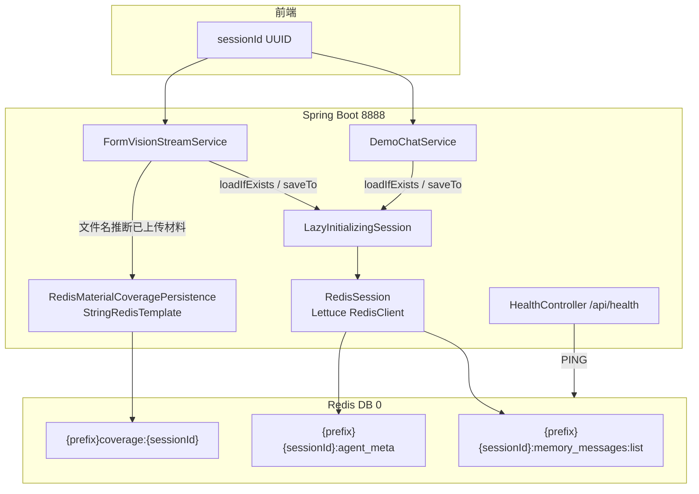
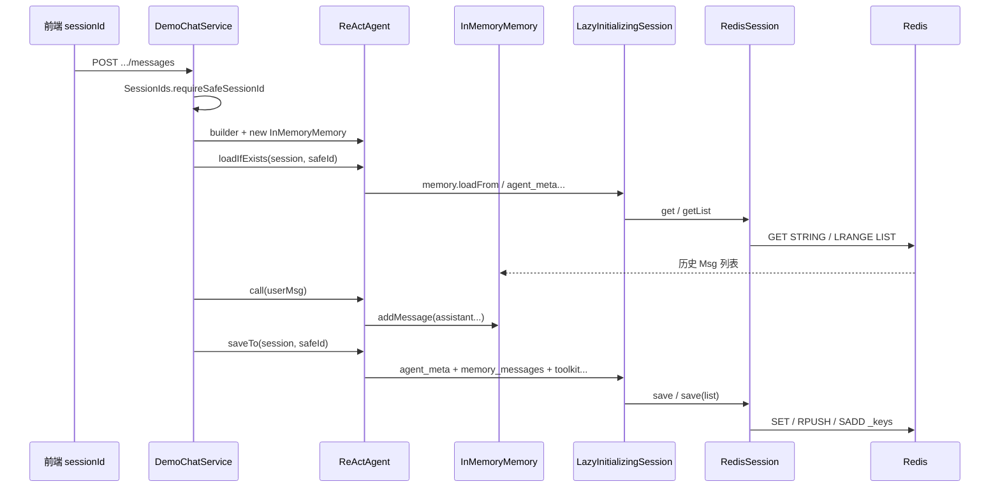

# Redis Session：架构、实现与本地数据解读

本文档说明 **multimodal-demo** 如何将 AgentScope **Session** 持久化到 Redis，并结合你本机 Redis（`localhost:6379` / `database: 0` / `password: 123456`）中的**真实键与数据结构**做对照解读。

与 Memory / Session 概念总览见 [README-MEMORY-SESSION.md](./README-MEMORY-SESSION.md)；Redis 章节仅作摘要，细节以本文为准。

**持久化原理（saveTo → RedisSession → 键结构）** 见 [第四章](#四session-持久化到-redis-的原理)。

### 为什么会出现 `io.agentscope.core.session.redis` 这个路径？

| 位置 | 是否本项目代码 | 说明 |
|------|----------------|------|
| **Maven 依赖 jar** | ✅ 官方实现 | `agentscope-extensions-session-redis` 内类，如 `RedisSession`、`LettuceClientAdapter` |
| **`src/main/java/io/agentscope/demo/...`** | ✅ 本项目 | 业务与 Spring 装配（如 `AgentscopeRedisSessionConfiguration`） |
| **仓库根 `io/agentscope/core/...`** | ❌ 应删除 | 多为从 jar **误解压** 的副本，不参与编译，易与官方版本冲突 |

本项目**只 import 官方类**，在 `AgentscopeRedisSessionConfiguration` 中 `RedisSession.builder()...build()` 注入 Spring；**不要**在仓库内维护一份 `RedisSession.java` 拷贝。根目录 `/io/agentscope/` 已加入 `.gitignore`。

查看官方源码：解压 `~/.m2/.../agentscope-extensions-session-redis-*.jar` 或 [GitHub 扩展仓库](https://github.com/agentscope-ai/agentscope-java/tree/main/agentscope-extensions/agentscope-extensions-session-redis)。

---

## 一、为什么要用 Redis Session

| 场景 | `store=file`（JsonSession） | `store=redis`（默认） |
|------|---------------------------|------------------------|
| 单机开发、无 Redis | ✅ 简单 | 需本地 Redis |
| 多实例 / K8s 水平扩展 | ❌ 会话绑在单机磁盘 | ✅ 共享同一 Redis |
| 进程重启后接着聊 | ✅（同机同目录） | ✅（任意实例可 `loadIfExists`） |

业务上：**聊什么、模型上下文** 走 `Session` + `InMemoryMemory`；**填什么表** 仍在前端 `localStorage`，不进 Redis。

---

## 二、选型说明

依据官方扩展 [agentscope-extensions-session-redis](https://github.com/agentscope-ai/agentscope-java/tree/main/agentscope-extensions/agentscope-extensions-session-redis)。

### 2.1 有几「种」方案？

| 层级 | 选项 | 说明 |
|------|------|------|
| **持久化介质** | `file` / `redis` | 本项目默认 `redis`；`JsonSession` 与 `RedisSession` 语义相同，仅介质不同 |
| **Redis 数据模型** | **1 套** | 固定键：`{prefix}{sessionId}:{stateKey}`（STRING）、`:list` / `:list:_hash`（LIST + 校验）、`:_keys`（SET） |
| **Redis 客户端** | **3 种** | 同一套 `RedisSession` + `RedisClientAdapter`，Builder **只选其一**：Jedis / Lettuce / Redisson |
| **部署拓扑** | 各客户端支持 Standalone；Lettuce/Jedis 另支持 Cluster、Sentinel；Redisson 另支持主从 | 键结构不变，只换连接方式 |

```text
RedisSession.builder()
  .jedisClient(...)      → JedisClientAdapter
  .lettuceClient(...)    → LettuceClientAdapter      ← 本项目
  .lettuceClusterClient(...)
  .redissonClient(...)  → RedissonClientAdapter
  .clientAdapter(...)    → 自定义
```

### 2.2 本项目为何用 Lettuce？

| 原因 | 说明 |
|------|------|
| 与 Spring Boot 3 一致 | `spring-boot-starter-data-redis` 默认 `lettuce-core`；coverage、健康检查已用 `StringRedisTemplate` |
| 配置复用 | `spring.data.redis.*` → `RedisURI` → `RedisClient.create(uri)`，与官方 Lettuce 示例一致 |
| 场景匹配 | 当前为单机 Redis；`.lettuceClient(RedisClient)` 最简单，无需 Redisson 的分布式对象能力 |
| 未选 Jedis | 与 Spring 栈重复，需另建 `UnifiedJedis` Bean，对 Session 无额外收益 |
| 未选 Redisson | Session 仅需 STRING/LIST/SET 级命令，依赖更重、配置更复杂 |

**说明**：AgentScope Session 使用独立 `RedisClient` Bean + `LazyInitializingSession`（首次对话再连 Redis），与 Spring 的 `RedisConnectionFactory` 分离，避免启动强依赖；代价是可能存在两条 Lettuce 连接，对 demo 可接受。

**切换客户端**：只改 `AgentscopeRedisSessionConfiguration` 的 Builder（如 `.jedisClient(...)` / `.redissonClient(...)`），**Redis 键格式不变**，连同一实例与 `key-prefix` 即可互读。

---

## 三、架构总览



### 3.1 两条 Redis 访问路径（重要）

| 用途 | 客户端 | Bean / 类 | 说明 |
|------|--------|-----------|------|
| Agent 状态（Memory、Agent meta、Toolkit） | **Lettuce** `RedisClient` | `AgentscopeRedisSessionConfiguration` → `RedisSession` | 官方扩展 `agentscope-extensions-session-redis` |
| 证照材料覆盖侧车（coverage） | **Spring** `StringRedisTemplate` | `RedisMaterialCoveragePersistence` | 本项目自定义，与 AgentScope 键空间同前缀 |

两者共用 `spring.data.redis.*` 连接参数（host / port / database / password），但 **API 与序列化逻辑不同**。

### 3.2 延迟连接

`LazyInitializingSession` 在应用**启动时不**连 Redis，仅在第一次 `loadIfExists` / `saveTo` 时创建底层 `RedisSession`。避免 Redis 尚未就绪导致 Spring 启动失败。

### 3.3 对话生命周期（与代码对应）

```
HTTP 请求携带 sessionId
    → ReActAgent 构建 + InMemoryMemory
    → agent.loadIfExists(session, safeSessionId)   // 从 Redis 恢复
    → agent.call(...) / 流式推理
    → agent.saveTo(session, safeSessionId)         // 写回 Redis
```

入口类：

- `DemoChatService` — 控制台多轮对话
- `FormVisionStreamService` — 证照影像 SSE 链路

---

## 四、Session 持久化到 Redis 的原理

本节说明 **本项目中** Agent 对话状态如何进入 Redis：从 HTTP 请求到 `RedisSession` 写键，以及和 `JsonSession` 磁盘版的对应关系。

### 4.1 分层：谁负责什么

| 层次 | 组件 | 职责 |
|------|------|------|
| **业务** | `DemoChatService` / `FormVisionStreamService` | 每请求 `new ReActAgent` + `InMemoryMemory`，结束时 `saveTo` / 开始时 `loadIfExists` |
| **Agent 框架** | `ReActAgent` | 把自身注册的 **StateModule**（Memory、Toolkit 等）序列化交给 `Session` |
| **存储抽象** | `Session` 接口 | `save` / `get` / `getList`，不关心 Redis 还是文件 |
| **本项目包装** | `LazyInitializingSession` | 首次 `load/save` 时才创建底层 `RedisSession` |
| **Redis 实现** | `RedisSession` + `LettuceClientAdapter` | JSON 写入 STRING/LIST，维护 `: _keys` 索引 |
| **Spring 装配** | `AgentscopeRedisSessionConfiguration` | `RedisClient` Bean、`keyPrefix`、条件 `store=redis` |

**不经过 Session 的数据**（勿与下文混淆）：证照 **coverage 侧车**（`StringRedisTemplate` 写 `coverage:{sessionId}`）、前端 **localStorage**、当次 **formContext**。

### 4.2 一次 HTTP 请求的完整链路

以下以文本对话 **`POST /api/sessions/{sessionId}/messages`** 为例，说明从浏览器发起到 Redis 落盘再返回的完整过程。核心规律是：**每轮 HTTP 新建一个空的 Agent 与 Memory，历史对话从 Redis 读入；本轮结束后再把更新后的状态写回 Redis**。右侧表单、证照 coverage 等**不在这条链路上**。



#### 阶段一：请求进入与 sessionId 校验

前端在 URL 中携带本会话的 **`sessionId`**（通常为页面加载时生成的 UUID），请求体为当前用户输入的 `content`。`DemoChatService` 首先调用 **`SessionIds.requireSafeSessionId`**：剔除非法字符、禁止路径穿越，保证该 id 只能作为 Redis 键名中的一段。校验失败则直接返回 400，**不会访问 Redis**。

#### 阶段二：组装「空壳」Agent（内存里尚无历史）

服务层 **`new InMemoryMemory()`** 并 `ReActAgent.builder()...build()`，按用户意图注册 Skill、拼接 systemPrompt 等。此时 JVM 里的 Memory **是空的**，上一轮对话并不自动留在堆中——这是有意设计，避免多请求共享可变 Agent 状态。

#### 阶段三：从 Redis 恢复历史（loadIfExists）

调用 **`agent.loadIfExists(agentscopeSession, safeId)`**：

1. 若为本进程**第一次**访问 Session，**`LazyInitializingSession`** 会先创建底层 **`RedisSession`** 并连接 Lettuce（打日志 `initializing redis session`）。
2. `ReActAgent` 检查 Redis 中是否存在该 `sessionId`（看 `_keys` 集合是否非空）。
3. **若存在**：通过 `Session.get` / `getList` 读取 `agent_meta`、`memory_messages:list` 等，反序列化后填入当前 Agent 与 **`InMemoryMemory`**。模型即将看到的是「历史多轮 Msg + 本轮用户输入」。
4. **若不存在**（新会话第一次说话）：`loadIfExists` 返回 false，Memory 仍为空，相当于从零开始聊。

对应 Redis 命令主要为：**`GET`**（单值 JSON）、**`LRANGE`**（消息列表），键名形如 `agentscope:multimodal-demo:{sessionId}:memory_messages:list`。

#### 阶段四：本轮推理（call）

**`agent.call(userMsg)`** 将用户消息追加到 Memory，调用 DashScope；ReAct 循环中可能产生 assistant、tool 等 Msg，均进入**当前请求**的 `InMemoryMemory`。此阶段**只读写 JVM 内存**，一般不访问 Redis（除非 Agent 内部另有工具逻辑）。

#### 阶段五：写回 Redis（saveTo）

请求结束前调用 **`agent.saveTo(agentscopeSession, safeId)`**：

1. **`ReActAgent`** 将 `agent_meta`（含 systemPrompt）、**`memory.saveTo`**（整份 Msg 列表）、`toolkit_activeGroups` 等交给 `Session`。
2. **`RedisSession`** 把各 state 序列化为 JSON：**单值**用 `SET`，**消息列表**用 `RPUSH`（或 hash 未变时增量追加），并在 **`{sessionId}:_keys`** 中登记键名。
3. HTTP 响应返回 `reply`、`formPatch` 等给前端；**此时 Redis 中的会话已与本轮对话对齐**，下次同 `sessionId` 请求会加载到包含本轮的完整历史。

若本轮失败且未执行 `saveTo`，Redis 中仍是上一轮结束时的快照，不会出现「半条写入」的 Msg 列表（以一次完整 `saveTo` 为边界）。

#### 阶段六：响应返回

`DemoChatService` 解析结构化结果、归一化 `formPatch`、按需构造 `uploadGuide`，封装为 **`ChatResponse`** 返回。前端更新对话气泡；表单补丁写 **localStorage**，**不**在此链路写入 Redis。

---

**与上图的对应关系**：时序图自上而下即阶段一～六；`LAZY` 仅在阶段三、五穿透到 `RS` → `R`。

**多图视觉 SSE**（`FormVisionStreamService`）：阶段二～五相同，区别是阶段四为 **`stream` + SSE 推送**，且在读图后会 **`mergeFromHints` 更新 coverage 侧车**（走 `StringRedisTemplate`，不经 `RedisSession`）。流式结束同样执行 **`saveTo`**，故 Redis 里会新增含 base64 图片的 USER Msg 与视觉 assistant 消息。

**多实例部署**：任意 Pod 只要连接同一 Redis、`key-prefix` 与 `sessionId`，阶段三读到的就是其他实例在阶段五写入的数据。

### 4.3 `saveTo` 写了哪些 state（ReActAgent）

`ReActAgent.saveTo` 按模块拆分写入（见 AgentScope 源码），对应 Redis 键如下（`{prefix}` = `agentscope:multimodal-demo:`）：

| state 键名 | Redis 结构 | 内容 |
|------------|------------|------|
| `agent_meta` | STRING（JSON） | Agent id、name、description、**当前 systemPrompt** |
| `memory_messages` | LIST + `:list:_hash` | 短期记忆：每条一个 **Msg** JSON（`memory_messages:list`） |
| `toolkit_activeGroups` | STRING（JSON） | 工具组激活状态，如 `skill-build-in-tools` |
| （若启用 Plan） | STRING / LIST | 计划本状态；本 demo 通常未用 |

`InMemoryMemory.saveTo` 调用：

```java
session.save(sessionKey, "memory_messages", new ArrayList<>(messages));
```

`RedisSession` 对 **List 型 state** 使用 `memory_messages:list` 存元素，并用 **hash** 做增量追加（见下节）。

同时向 **`{prefix}{sessionId}:_keys`**（SET）登记 `agent_meta`、`memory_messages:list`、`toolkit_activeGroups` 等，便于 `delete(sessionId)` 时整会话清理。

### 4.4 `RedisSession` 落盘规则（官方扩展）

**单值 state**（如 `agent_meta`）：

1. `JsonUtils` 将 `State` 对象序列化为 JSON 字符串。  
2. `SET {prefix}{sessionId}:{stateKey}`。  
3. `SADD {prefix}{sessionId}:_keys` 记录 state 名。

**列表 state**（如 `memory_messages`）：

1. 计算当前消息列表的 **hash**（`ListHashUtil`）。  
2. 与 Redis 中 `memory_messages:list:_hash` 比较；  
   - **hash 变或长度变**：可能 **整表重写**（`DEL` list 后逐条 `RPUSH`），或 **仅追加** 新增尾部 Msg（增量优化）。  
3. 更新 `:list:_hash`；在 `_keys` 中登记 `memory_messages:list`。

**读取**（`loadIfExists` / `loadFrom`）：

- 单值：`GET` → 反序列化。  
- 列表：`LRANGE 0 -1` → 每条 JSON 反序列化为 `Msg` → 填入 `InMemoryMemory`。

因此磁盘上的 `memory_messages.jsonl` 与 Redis 的 `memory_messages:list` **语义相同**（一行/一条 Msg），**物理格式不同**。

### 4.5 本项目特有的装配细节

**1. 条件装配**

- `agentscope.session.store=redis` → `AgentscopeRedisSessionConfiguration` 生效，`AgentscopeFileSessionConfiguration` 不注册 `Session` Bean。  
- `store=file` 时相反，使用 `JsonSession`。

**2. Lettuce 独立客户端**

```text
spring.data.redis.*  →  RedisURI  →  RedisClient.create(uri)
                              →  RedisSession.builder().lettuceClient(...).keyPrefix(...).build()
```

与 Spring `RedisConnectionFactory`（coverage、health）**可并存两条连接**，配置来源相同。

**3. 延迟连接**

```text
Spring 启动 → 注册 LazyInitializingSession（内部 delegate=null）
第一次 loadIfExists / saveTo → synchronized 创建 RedisSession → 打日志 initializing redis session
```

避免 Redis 未启动时应用无法拉起；首次对话略慢。

**4. sessionId 安全**

`SessionIds.requireSafeSessionId` 限制字符集与长度，使 `sessionId` 只能作为 Redis 键的一段，避免注入异常键名。

### 4.6 与「每请求新建 Agent」如何配合

| 现象 | 原理 |
|------|------|
| 每轮 HTTP 都 `new InMemoryMemory()` | 堆内记忆是空的；**历史来自 Redis** 的 `loadIfExists` |
| 同一 `sessionId` 多轮可接续 | 靠 **同一 Redis 键空间** 反复 `saveTo` 覆盖/追加 |
| 多实例共享会话 | 任意 Pod 连同一 Redis + 同一 `key-prefix` + 同一 `sessionId` 即可 `load` |
| 并发同 session 两请求 | 后写的 `saveTo` 可能覆盖先写（产品假设单页单会话） |

**口诀**：**Agent 每请求新建，状态在 Redis 里按 sessionId 续命。**

### 4.7 和 coverage 侧车的边界

| | AgentScope Session | coverage 侧车 |
|--|-------------------|---------------|
| 写入 API | `agent.saveTo` → `RedisSession.save` | `UploadMaterialCoverageStore.mergeFromHints` |
| Redis 键 | `{prefix}{sessionId}:memory_messages:list` 等 | `{prefix}coverage:{sessionId}` |
| 内容 | 对话 Msg、Agent 元数据 | `["BUSINESS_LICENSE", ...]` |
| 是否给 LLM | 是（load 进 Memory） | 否（仅业务规则 / systemPrompt 注入） |

---

## 五、配置说明

### 5.1 应用配置（`application.yml`）

```yaml
agentscope:
  session:
    store: ${AGENTSCOPE_SESSION_STORE:redis}
    key-prefix: ${AGENTSCOPE_SESSION_KEY_PREFIX:agentscope:multimodal-demo:}

spring:
  data:
    redis:
      host: ${REDIS_HOST:localhost}
      port: ${REDIS_PORT:6379}
      database: ${REDIS_DATABASE:0}
      timeout: ${REDIS_TIMEOUT:3s}
      # password 勿在默认 yml 写空字符串，否则 NOAUTH 行为异常
```

### 5.2 本地 Redis（你的环境）

在 `application-local.yml`（参考 `application-local.yml.example`）中配置：

```yaml
spring:
  data:
    redis:
      host: localhost
      port: 6379
      database: 0
      password: "123456"
```

或使用环境变量：

```bash
export REDIS_HOST=localhost
export REDIS_PORT=6379
export REDIS_DATABASE=0
export REDIS_PASSWORD=123456
export AGENTSCOPE_SESSION_STORE=redis
```

### 5.3 健康检查

```bash
curl -s http://localhost:8888/api/health | jq .
```

期望（Redis 正常时）：

```json
{
  "status": "UP",
  "sessionStore": "redis",
  "redis": "UP"
}
```

Redis 不可达时 `status` 为 `DEGRADED`，`redis` 为 `DOWN`。

### 5.4 无 Redis 时回退

```yaml
agentscope:
  session:
    store: file
```

数据目录：`agentscope.session.file-root`（默认 `data/agentscope-sessions/{sessionId}/`）。

---

## 六、键命名规范

默认前缀：`agentscope:multimodal-demo:`（`AgentscopeProperties.normalizedKeyPrefix()` 保证末尾有 `:`）

设 `sessionId = 5b12a0f4-0c15-4500-be60-76042d95c825`，则：

| Redis 类型 | 键 | 来源 | 说明 |
|------------|-----|------|------|
| **SET** | `agentscope:multimodal-demo:{sessionId}:_keys` | RedisSession | 该会话已持久化的 state 名集合 |
| **STRING** | `...:{sessionId}:agent_meta` | RedisSession | Agent 元数据 JSON |
| **LIST** | `...:{sessionId}:memory_messages:list` | RedisSession | 短期记忆，每条一个 `Msg` JSON |
| **STRING** | `...:{sessionId}:memory_messages:list:_hash` | RedisSession | 列表内容校验哈希（变更检测） |
| **STRING** | `...:{sessionId}:toolkit_activeGroups` | RedisSession | 工具组激活状态 |
| **STRING** | `agentscope:multimodal-demo:coverage:{sessionId}` | 本项目 | 已推断上传的材料 ID 列表，TTL 90 天 |

与 **JsonSession 磁盘布局** 的对应关系：

| 磁盘（`store=file`） | Redis（`store=redis`） |
|---------------------|------------------------|
| `memory_messages.jsonl`（多行） | `memory_messages:list`（Redis LIST，每元素一行 JSON） |
| `agent_meta.json` | `agent_meta`（STRING） |
| `upload_material_coverage.json` | `coverage:{sessionId}`（STRING） |

---

## 七、各键数据结构详解

### 7.1 `_keys`（SET）

成员示例（本机实测）：

```
agent_meta
memory_messages:list
toolkit_activeGroups
```

表示当前 session 在 Redis 中注册了哪些 **state 键名**（不含前缀与 sessionId）。`RedisSession.delete(sessionId)` 时会据此清理。

### 7.2 `agent_meta`（STRING → JSON）

结构（字段随 Agent 构建方式略有差异）：

```json
{
  "id": "1f5e908f-d9c8-41dd-b6d5-77c9ff8eb679",
  "name": "ConsoleChatAgent",
  "description": "Agent(...) ConsoleChatAgent",
  "systemPrompt": "你是企业工商与资质信息填报助手。技能 form_vision_fill ..."
}
```

- 保存 **Agent 身份与 systemPrompt**（含动态注入的「本会话材料覆盖推断」等）。
- **不是**用户可见的聊天正文；正文在 `memory_messages:list`。

### 7.3 `memory_messages:list`（LIST → 每元素一条 Msg JSON）

AgentScope 将 `InMemoryMemory` 中的消息序列化为 **AgentScope `Msg` 的 JSON**，与官方 `JsonSession` 的 jsonl 行格式一致，只是存储介质改为 Redis List。

单条消息常见字段：

| 字段 | 含义 |
|------|------|
| `id` | 消息 UUID |
| `role` | `USER` / `ASSISTANT` / `TOOL` |
| `name` | 如 `FormVisionAgent`、`ConsoleChatAgent`、`generate_response` |
| `content` | 数组：`text` / `image` / `thinking` / `tool_use` / `tool_result` 等 |
| `metadata` | 如 `_chat_usage`、`response`（结构化输出解析结果） |
| `timestamp` | 本地时间字符串 |

**content 类型说明（本项目中常见）**

| type | 说明 |
|------|------|
| `text` | 用户文字或模型最终文本 |
| `image` | `source.type=base64` 的证照图（体积大，LIST 首条 USER 消息可达数百 KB） |
| `thinking` | 模型思考链（开启 vision thinking 时） |
| `tool_use` / `tool_result` | ReAct 工具调用与结果（如 `load_skill_through_path`） |

### 7.4 `memory_messages:list:_hash`（STRING）

本机值示例：`a0106fcd`（短哈希）。用于检测消息列表是否变化，避免无效读写（RedisSession 内部机制）。

### 7.5 `toolkit_activeGroups`（STRING → JSON）

```json
{
  "activeGroups": ["skill-build-in-tools"]
}
```

记录 Agent 工具包中当前激活的分组。

### 7.6 `coverage:{sessionId}`（STRING → JSON 数组）

**本项目独有**，不由 `RedisSession` 写入，由 `RedisMaterialCoveragePersistence` 维护：

```json
["BUSINESS_LICENSE"]
```

- 元素为 canonical 材料 ID（如 `BUSINESS_LICENSE`、`ID_CARD_FRONT`、`HAZARDOUS_CHEMICAL_LICENSE`、`ROAD_DANGEROUS_GOODS_TRANSPORT`），顺序经 `MaterialSampleIds.CANONICAL_ORDER` 过滤。
- 来源：上传文件名关键词推断 + 合并历史，供 systemPrompt 注入「已出现 / 尚未出现」。
- **TTL**：90 天（`Duration.ofDays(90)`）。

---

## 八、本机 Redis 实况（2026-05-19 采样）

连接：`localhost:6379`，`SELECT 0`，密码 `123456`。

```text
KEY_COUNT agentscope:multimodal-demo:*  →  6
```

| 类型 | 键 |
|------|-----|
| set | `agentscope:multimodal-demo:5b12a0f4-0c15-4500-be60-76042d95c825:_keys` |
| string | `...:agent_meta` |
| list | `...:memory_messages:list`（长度 **7**） |
| string | `...:memory_messages:list:_hash` |
| string | `...:toolkit_activeGroups` |
| string | `agentscope:multimodal-demo:coverage:5b12a0f4-0c15-4500-be60-76042d95c825` |

### 8.1 七条消息轮次摘要

| 索引 | role | name | 内容要点 |
|------|------|------|----------|
| 0 | USER | — | 上传营业执照.jpg + **base64 图像**（体积最大） |
| 1 | ASSISTANT | FormVisionAgent | thinking + `load_skill_through_path` |
| 2 | TOOL | FormVisionAgent | 返回 form_vision_fill 技能全文 |
| 3 | ASSISTANT | generate_response | 结构化 `form_patch`（公司名、统一社会信用代码等） |
| 4 | USER | — | 文本：「还需要什么」 |
| 5 | ASSISTANT | ConsoleChatAgent | 追问仍缺材料（身份证、危运证、危化证） |
| 6 | ASSISTANT | generate_response | JSON：`form_patch:{}`，`upload_guide:null`，reply 与缺项说明 |

### 8.2 coverage 与 agent_meta 的一致性

- `coverage` = `["BUSINESS_LICENSE"]` → 与 agent_meta 中 systemPrompt「已出现：营业执照」一致。
- 未出现：`ID_CARD_FRONT`、危运证、危化证等（与 reply 缺项列表一致）。

---

## 九、本地排查命令

### 9.1 redis-cli（若已安装）

```bash
redis-cli -h localhost -p 6379 -a 123456 -n 0 --no-auth-warning PING

redis-cli -h localhost -p 6379 -a 123456 -n 0 --no-auth-warning \
  KEYS "agentscope:multimodal-demo:*"

redis-cli -h localhost -p 6379 -a 123456 -n 0 --no-auth-warning \
  SMEMBERS "agentscope:multimodal-demo:<sessionId>:_keys"

redis-cli -h localhost -p 6379 -a 123456 -n 0 --no-auth-warning \
  LLEN "agentscope:multimodal-demo:<sessionId>:memory_messages:list"

redis-cli -h localhost -p 6379 -a 123456 -n 0 --no-auth-warning \
  GET "agentscope:multimodal-demo:coverage:<sessionId>"
```

### 9.2 Python（本仓库文档编写时环境无 redis-cli，使用 redis-py）

```bash
pip install redis
python3 -c "
import redis, json
r = redis.Redis(host='localhost', port=6379, password='123456', db=0, decode_responses=True)
print('PING', r.ping())
for k in sorted(r.keys('agentscope:multimodal-demo:*')):
    print(r.type(k), k)
"
```

查看某条消息（避免打印含 base64 的第 0 条）：

```python
import redis, json
r = redis.Redis(host='localhost', port=6379, password='123456', db=0, decode_responses=True)
key = "agentscope:multimodal-demo:<sessionId>:memory_messages:list"
msg = json.loads(r.lindex(key, 1))
print(json.dumps(msg, ensure_ascii=False, indent=2))
```

---

## 十、依赖与代码索引

| Maven 依赖 | 作用 |
|------------|------|
| `agentscope-extensions-session-redis` | `RedisSession` |
| `spring-boot-starter-data-redis` | `StringRedisTemplate`、健康检查 PING |

| Java 类 | 职责 |
|---------|------|
| `AgentscopeRedisSessionConfiguration` | Lettuce + `RedisSession` + `LazyInitializingSession` |
| `AgentscopeFileSessionConfiguration` | `store=file` 时 `JsonSession` |
| `AgentscopeSessionConfiguration` | `@Import` 上述二者，按 `agentscope.session.store` 条件装配 |
| `RedisMaterialCoveragePersistence` | coverage 键读写 |
| `DemoChatService` / `FormVisionStreamService` | `loadIfExists` / `saveTo` |
| `HealthController` | `/api/health` |

官方扩展说明：[agentscope-extensions-session-redis](https://github.com/agentscope-ai/agentscope-java/tree/main/agentscope-extensions/agentscope-extensions-session-redis)

---

## 十一、运维与迁移注意

1. **键前缀隔离**：多环境共用同一 Redis 时，务必区分 `AGENTSCOPE_SESSION_KEY_PREFIX`（如 `agentscope:multimodal-demo:dev:`）。
2. **大 value**：含证照 base64 的 USER 消息会显著增大 Redis 内存；必要时可评估是否仅存 URL/OSS 路径（需改业务与 Msg 构造）。
3. **磁盘 → Redis**：`JsonSession` 与 `RedisSession` **语义相同、存储不同**；`coverage` 需单独从 `upload_material_coverage.json` 导入。无官方一键工具，可按 sessionId 脚本迁移或让用户新建会话。
4. **清空某会话**：
   - Agent 状态：调用 AgentScope `session.delete(sessionKey)` 或删除 `{prefix}{sessionId}:*` 与 `_keys`。
   - Coverage：删除 `agentscope:multimodal-demo:coverage:{sessionId}`。
5. **密码为空**：不要在 `application.yml` 写 `password:` 空值；无密码则省略该字段，有密码用 `application-local.yml` 或 `REDIS_PASSWORD`。

---

## 十二、与 README-MEMORY-SESSION 的关系

| 文档 | 内容 |
|------|------|
| [README-MEMORY-SESSION.md](./README-MEMORY-SESSION.md) | Memory vs Session、四态对照、长期记忆、Redis 摘要 |
| **README-REDIS.md（本文）** | **选型说明**（file/redis、Jedis/Lettuce/Redisson）、架构、键结构、本机样例与排查 |
