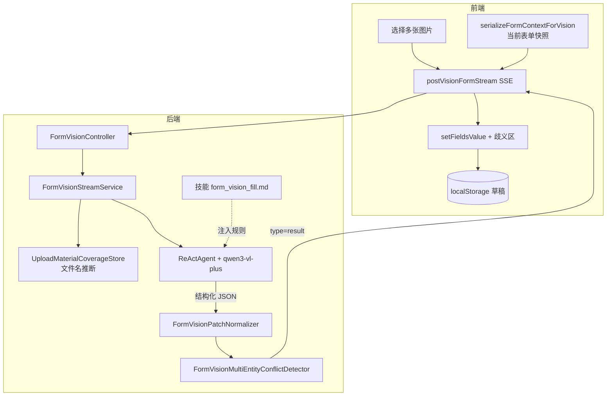

# form_vision_fill：证照影像 → 表单回填

本文档说明 **multimodal-demo** 中「上传图片 → 视觉模型识别 → 右侧 Ant Design 表单自动填充」的完整链路，基于技能 **`form_vision_fill`**。面向需要改字段、加证照类型或排查识别问题的开发者。

相关文档：[README.md](./README.md)（总览）、[README-MEMORY-SESSION.md](./README-MEMORY-SESSION.md)（Session / formContext）、[README-REDIS.md](./README-REDIS.md)（对话持久化）。

---

## 一、一句话理解

| 角色 | 做什么 |
|------|--------|
| **模型（技能）** | 看图 + 读规则，输出 `form_patch`（要填哪些键）、`ambiguities`（拿不准的候选项）、`reply`（中文说明） |
| **后端（宿主）** | 归一化键名、检测多主体冲突、通过 SSE 下发；**不**让模型直接改数据库或 Redis 表单 |
| **前端** | 把 `form_patch` 写入 `Form.setFieldsValue`，歧义区 Radio 点选后再填；草稿在 **localStorage** |

**重要**：模型只负责「建议填什么」；最终能否进表单，还受 **白名单键**、**歧义规则**、**DatePicker 类型转换** 约束。

---

## 二、端到端流程（从用户点击上传到表单有值）



### 分步说明（易懂版）

1. **用户**在对话区选图（可多选），前端生成 `sessionId`，右侧表单可能已有内容。
2. **前端**把图片 + 可选 **`formContext`**（当前表单 JSON）POST 到  
   `POST /api/sessions/{sessionId}/vision/form-stream`。
3. **后端**异步线程：读图 → base64 → 调 **视觉模型**；技能全文约束输出格式。
4. 模型返回 **`FormVisionExtraction`**（见下节）；后端依次：
   - **归一化** `form_patch` 键名（别名 → camelCase 白名单）；
   - **歧义检测**（多公司名 / 多证号 / 与已填报冲突）→ 可能清空部分键并生成 `ambiguities`；
   - **`upload_guide` 强制 null**（材料卡只在文本对话链路出现）。
5. **SSE `result`** 到达前端：`form.setFieldsValue(patch)`，有歧义则显示黄色确认区。
6. **用户**在歧义区点选后，对应字段才写入表单；`persistForm()` 存 localStorage。
7. **后端** `agent.saveTo(session)`：本轮对话（含大图 Msg）写入 Session（Redis/文件），与表单 localStorage **无关**。

---

## 三、技能 `form_vision_fill` 管什么

文件：`src/main/resources/skills/form_vision_fill.md`  
加载：`SkillLoader.formVisionFill()` → `SkillBox.registerSkill`（仅视觉链路；文本对话也会注册该技能作结构化输出参考）。

### 3.1 模型必须输出的三块

| 字段 | JSON 名 | 用途 |
|------|---------|------|
| 表单补丁 | `form_patch` | camelCase 键 → 值；**有把握才写**，读不清不写 |
| 歧义列表 | `ambiguities` | 多候选时逐字段 `field_key`、`question_for_user`、`options[]` |
| 说明 | `reply` | 固定四段：【识别概要】【已抽取字段】【待确认/歧义】【未覆盖/说明】 |

视觉链路 **不产出** `upload_guide`（技能正文也写明；后端会再置 `null`）。

### 3.2 字段分组（与表单区块对应）

| 分组 | 键前缀 / 代表键 | 证照来源 |
|------|-----------------|----------|
| 工商主体 | `companyName`、`unifiedSocialCreditCode`、`legalRepresentative`、`registrationDate`… |  mainly **营业执照** |
| 危化经营 | `safety*` | **危险化学品经营许可证** |
| 道路危运 | `transport*` | **道路危险货物运输许可证** |
| 企业资质证件 | `qualificationIdDocType`、`qualificationIdDocNumber` | **身份证人像面** 等 |

证名类键（`safetyAdminLicenseName`、`transportAdminLicenseName`）**只能**写法定证照全称，禁止把「许可范围」「天然气…」等经营范围塞进证名键（技能 + 后端 `correctAdminLicenseNames` 双保险）。

### 3.3 多主体规则（技能 + 后端强制执行）

典型场景：

- 一次上传多张营业执照，公司名不一致；
- 先填了公司 A（表单或上一轮），再上传危化证识别出公司 B。

此时技能要求：**冲突键不得进 `form_patch`**，必须进 `ambiguities`。  
后端 `FormVisionMultiEntityConflictDetector` 会再扫一遍 raw patch + **formContext（已填报）**，避免模型漏判。

---

## 四、后端处理链（模型之后、SSE 之前）

入口：`FormVisionStreamService.runAnalysis`  
控制器：`FormVisionController`（立即返回 SSE，线程池执行分析）。

| 顺序 | 类 | 作用 |
|------|-----|------|
| 1 | `FormVisionStreamService` | 组 Msg（说明文字 + 多图 base64）、流式/兜底 `call`、组装 SSE |
| 2 | `FormVisionPatchNormalizer` | **白名单** + **别名表** + 日期 ISO + 证名纠正 |
| 3 | `FormVisionFormContextSupport` | 解析 multipart `formContext` → 归一化已填报表单 |
| 4 | `FormVisionMultiEntityConflictDetector` | 多主体 / 跨轮冲突 → 改 `form_patch` + `ambiguities` |
| 5 | SSE `result` | `reply`、`formPatch`、`ambiguities`、三个 `multi_*_conflict_applied` 标志 |

### 4.1 `FormVisionPatchNormalizer` 要点

- **`CANONICAL_KEYS`**：允许进入前端的键集合；模型自造键（如 `enterpriseName`）经 **别名** 映射到 `companyName`，否则丢弃。
- **日期**：`registrationDate`、许可证有效期 range → `yyyy-MM-dd` 或 `[start,end]`。
- **证名**：若出现危化/运输证字段但证名不像标准标题 → 替换为「危险化学品经营许可证」「道路危险货物运输许可证」。

与前端约定：注释写明须与 `App.tsx` 的 `Form.Item name`、`api.ts` 中 `VISION_*_FIELD_KEYS` 一致。

### 4.2 `FormVisionMultiEntityConflictDetector` 要点

- 输入：**归一化后的 patch**、**原始 raw patch**（单键归一化收集多候选）、**existingForm**（formContext）。
- 输出：可能 **remove** `companyName` 等；**append** `AmbiguousFieldDto`；`reply` 追加【系统提示】。
- 清空哨兵：`CLEAR_FIELD_SENTINEL = "__CLEAR_FIELD__"`，前端点选「不采用识别内容」时使用。

### 4.3 与「材料覆盖」的关系（易混）

上传后 `mergeFromHints(文件名)` → Redis/文件中的 **`coverage:{sessionId}`**。  
用于文本对话「还缺什么」和 systemPrompt 注入，**不参与** `form_patch` 计算。  
**不能**靠改文件名规则替代 OCR 填表。

---

## 五、前端如何落到表单

主要文件：`frontend/src/App.tsx`、`frontend/src/api.ts`。

### 5.1 上传与 formContext

```typescript
const formContextJson = serializeFormContextForVision(
  form.getFieldsValue(true),
);
await postVisionFormStream(sessionId, files, onEvent, signal, formContextJson);
```

`formContext` 让后端知道「上传前右侧已填什么」，用于歧义里的 **已填报（当前表单）** 标签。

### 5.2 收到 `result` 时

```text
sanitizeVisionAmbiguities
  → normalizeVisionAmbiguities（合并同 field_key）
  → augmentVisionFormPatchForHostClears（歧义键在 patch 缺失时写 undefined，清旧值）
  → normalizeVisionFormPatch（字符串日期 → dayjs，range → [dayjs, dayjs]）
  → form.setFieldsValue(patch)
  → persistForm() → localStorage
```

`uploadGuide` 在视觉链路忽略（后端已为 null）。

### 5.3 歧义区交互

- 黄色 Alert「需您确认的内容」；
- 用户选 Radio → `patchFromAmbiguityChoice` → `setFieldsValue` → 从列表移除该歧义项。

### 5.4 SSE 事件类型（调试参考）

| type | 含义 |
|------|------|
| `progress` | 读图进度 / 进入推理 |
| `thinking` | 模型思考链增量 |
| `assistant_text` | 中间文本增量 |
| `result` | **最终** formPatch + ambiguities + reply |
| `done` | 流结束 |
| `error` | 失败信息 |

---

## 六、数据契约速查

### 6.1 后端 DTO → 前端（SSE result）

Jackson 默认 camelCase 序列化（`formPatch`）；技能 JSON 使用 snake_case（`form_patch`），由 AgentScope 结构化层转换。

| 字段 | 类型 | 说明 |
|------|------|------|
| `reply` | string | 对话气泡正文 |
| `formPatch` | object | 通过白名单的键值 |
| `ambiguities` | array | `field_key`、`question_for_user`、`options[{option_id,label,suggested_value}]` |
| `uploadGuide` | null | 视觉链路固定 null |
| `multi_enterprise_conflict_applied` | boolean | 曾整族清理工商歧义键（前端主要靠 ambiguities 列表清键） |
| `multi_transport_conflict_applied` | boolean | transport* 族 |
| `multi_safety_conflict_applied` | boolean | safety* 族 |

### 6.2 当前支持的证照类型（产品层）

与 `MaterialSampleIds`、样图 `frontend/public/samples/` 一致：

| ID | 中文名 |
|----|--------|
| `BUSINESS_LICENSE` | 营业执照 |
| `ID_CARD_FRONT` | 身份证人像面 |
| `ROAD_TRANSPORT_PERMIT` | 道路危险货物运输许可证 |
| `SAFETY_PRODUCTION_PERMIT` | 危险化学品经营许可证 |

模型通过 **图像内容** 识别证照类型；coverage 仅通过 **文件名** 记录「是否上传过该类文件」。

---

## 七、现有字段逐键对照表

下列 **32 个** `form_patch` 键与 `FormVisionPatchNormalizer.CANONICAL_KEYS`、`App.tsx` 的 `Form.Item name` 一一对应。改字段或排查「模型有值、表单无值」时，先在本表定位该键，再对照归一化与歧义列。

### 7.0 图例（多主体 / 歧义列）

| 标记 | 含义 | 后端常量 / 行为 |
|------|------|-----------------|
| **◆** | 多张营业执照等多主体时，**整族工商键**从 patch 剔除并可能逐项歧义 | `ENTERPRISE_BASIC_KEYS`；前端 `VISION_ENTERPRISE_FIELD_KEYS` 整族清空 |
| **◇** | 多主体时 **仅从 patch 剔除**（常出现在 `ambiguities`），其余工商键可继续自动回填 | `ENTERPRISE_AMBIGUITY_KEYS`：`companyName`、`companyShortName`、`unifiedSocialCreditCode` |
| **○** | 多轮上传：与 **formContext 已填报** 或本轮识别不一致时，**逐项**歧义（不单清整族） | `ENTERPRISE_CROSS_UPLOAD_KEYS` |
| **▲** | 多张危化证 / 多证号等：运输或危化 **整族** 处理 | `TRANSPORT_PERMIT_KEYS` / `SAFETY_PERMIT_KEYS` |
| **—** | 不参与上述族级规则；仍可由模型单独写入 `ambiguities` | — |

**证面映射（技能强制，后端 `correctAdminLicenseNames` 兜底）**

| 证面字样 | 应写入键 | 禁止写入 |
|----------|----------|----------|
| 营业执照「名称」 | `companyName` | `enterpriseName`、`businessName`（前端歧义别名会转到 `companyName`） |
| 危化证「企业名称」 | `companyName` | `safetyAdminLicenseName` |
| 危化证「主要负责人」 | `safetyLegalRepresentative` | 经营范围 → `businessScope`（勿写入证名键） |
| 运输证「业户名称」 | `companyName` | `transportAdminLicenseName` |
| 身份证「公民身份号码」 | `qualificationIdDocNumber` | 有号码无类型时后端默认 `qualificationIdDocType` = `身份证` |

---

### 7.1 企业基本信息（工商主体）

| `form_patch` 键 | 表单标签 | 主要证照来源 | 值类型 / 格式 | 归一化与别名（摘要） | 多主体 / 歧义 |
|-----------------|----------|--------------|---------------|----------------------|---------------|
| `companyName` | 公司名称 | 营业执照「名称」；危化/运输证「企业名称」「业户名称」 | 字符串 | `enterpriseName`、`businessName`、`company_name`、`businessLicenseName`、`safetyCompanyName`、`transportCompanyName` 等 → 本键 | **◆ ◇ ○** |
| `companyShortName` | 公司简称 | 营业执照（若有）；常需用户简称 | 字符串 | 无专用别名 | **◆ ◇** |
| `formerName` | 公司曾用名 | 营业执照 | 字符串 | — | **◆ ○** |
| `legalRepresentative` | 法定代表人（工商证照） | 营业执照「法定代表人」 | 字符串 | `legalRep`、`businessLicenseLegalRepresentative` | **◆ ○** |
| `enterpriseType` | 企业类型 | 营业执照「类型」 | 字符串；前端 Select：`有限责任公司` / `股份有限公司` / `外商投资企业` | `type`、`companyType`、`businessLicenseType` | **◆ ○** |
| `enterpriseNature` | 企业性质 | 营业执照或登记信息 | 字符串；前端 Select：`国有` / `民营` / `混合所有制` | — | **◆ ○** |
| `registrationDate` | 注册日期 | 营业执照「成立日期」等 | ISO `yyyy-MM-dd`；前端 `dayjs` | `establishmentDate`、`foundingDate`、`businessLicenseEstablishmentDate`；支持中文「年月日」 | **◆ ○**；歧义点选需能解析 ISO |
| `registeredCapital` | 注册资本(万元) | 营业执照 | 字符串（含「万元」可原样） | `businessLicenseRegisteredCapital` | **◆ ○** |
| `registeredZip` | 注册地邮编 | 营业执照地址区划 | 字符串，最多 6 位（前端） | — | **◆ ○** |
| `registeredRegion` | 注册地行政区划 | 营业执照住所拆分 | 字符串 | — | **◆ ○** |
| `registeredAddressDetail` | 注册地址（住所） | 营业执照「住所」 | 字符串 | `address`、`registeredAddress`、`domicile`、`businessLicenseAddress` | **◆ ○** |
| `actualLocation` | 实际经营地址 | 证照或登记簿（若有） | 字符串 | — | **◆ ○** |
| `businessScope` | 经营范围 | 营业执照；**勿**把危化「许可范围」写入证名键 | 多行字符串 | 误写入 `safety*` 前缀的 scope 类键会 alias 到本键 | **◆ ○** |
| `companyPhone` | 公司电话 | 一般非证面，多为补录 | 字符串 | — | **—** |
| `companyEmail` | 公司邮箱 | 一般非证面 | 字符串 | — | **—** |
| `companyFax` | 公司传真 | 一般非证面 | 字符串 | — | **—** |
| `learnChannel` | 获知渠道 | 非证照字段 | 字符串 | — | **—** |

---

### 7.2 企业资质信息

| `form_patch` 键 | 表单标签 | 主要证照来源 | 值类型 / 格式 | 归一化与别名（摘要） | 多主体 / 歧义 |
|-----------------|----------|--------------|---------------|----------------------|---------------|
| `unifiedSocialCreditCode` | 统一社会信用代码 | 营业执照 | 18 位字符串 | `creditCode`、`socialCreditCode`、`businessLicenseUnifiedSocialCreditCode` | **◆ ◇ ○** |
| `qualificationIdDocType` | 证件类型（与号码并排） | 身份证人像面；缺省推断 | `身份证` / `护照` / `港澳居民来往内地通行证` | 仅有 `qualificationIdDocNumber` 时后端 `putIfAbsent("身份证")` | **—** |
| `qualificationIdDocNumber` | 证件号码 | 身份证「公民身份号码」 | 字符串 | `idCardNumber`、`idNumber`、`citizenIdNumber` | **—** |

---

### 7.3 专业资质 — 危险化学品经营许可证（`safety*`）

| `form_patch` 键 | 表单标签 | 主要证照来源 | 值类型 / 格式 | 归一化与别名（摘要） | 多主体 / 歧义 |
|-----------------|----------|--------------|---------------|----------------------|---------------|
| `safetyAdminLicenseName` | 行政许可名称 | 证面标题 | 固定全称：**危险化学品经营许可证** | `safetyPermitName`、`safetyCertificateName`；非标准标题会被 **纠正** | **▲** |
| `safetyLicenseNo` | 编号 | 危化证编号 | 字符串 | `safetyPermitNumber`、`safetyLicenseNumber` | **▲** |
| `safetyLicenseValidityMode` | 有效期模式 | 证面「长期」等 | `fixed` \| `long`；默认与 range 联动 | 有 `safetyLicenseValidityRange` 时缺省 `fixed` | **▲** |
| `safetyLicenseValidityRange` | 有效期起止 | 证面有效期 | `[start,end]` ISO；前端 `[dayjs, dayjs]` | 合并 `safetyPermitValidityPeriodStart/End` 等自创键 | **▲** |
| `safetyIssuingAuthority` | 发证机构 | 危化证 | 字符串 | `safetyPermitIssuingAuthority`、`safetyIssueAuthority` | **▲** |
| `safetyLegalRepresentative` | 法定代表人（负责人） | 证面「主要负责人」 | 字符串 | `safetyLegalRep`、`safetyPermitLegalRepresentative` | **▲** |

前端 `initialValues`：`safetyLicenseValidityMode` 默认 **`fixed`**。

---

### 7.4 专业资质 — 道路危险货物运输许可证（`transport*`）

| `form_patch` 键 | 表单标签 | 主要证照来源 | 值类型 / 格式 | 归一化与别名（摘要） | 多主体 / 歧义 |
|-----------------|----------|--------------|---------------|----------------------|---------------|
| `transportAdminLicenseName` | 行政许可名称 | 证面标题 | 固定全称：**道路危险货物运输许可证** | `transportPermitName`、`transportCertificateName`；非标准标题 **纠正** | **▲** |
| `transportLicenseNo` | 编号 | 运输证编号 | 字符串 | `transportPermitNumber`、`transportLicenseNumber` | **▲** |
| `transportLicenseValidityMode` | 有效期模式 | 证面 | `fixed` \| `long` | 有 range 时缺省 `fixed` | **▲** |
| `transportLicenseValidityRange` | 有效期起止 | 证面 | `[start,end]` ISO | 合并 `transportPermitValidityPeriodStart/End` 等 | **▲** |
| `transportIssuingAuthority` | 发证机构 | 运输证 | 字符串 | `transportPermitIssuingAuthority`、`transportIssueAuthority` | **▲** |
| `transportLegalRepresentative` | （隐藏项） | 运输证负责人 | 字符串 | 表单项 `hidden`；仍进白名单与 **▲** 族 | **▲** |

前端 `initialValues`：`transportLicenseValidityMode` 默认 **`long`**（与危化区块不同，填表时注意 UI 默认与识别结果可能不一致）。

---

### 7.5 前端专用（非 `form_patch` 键）

| 名称 | 作用 |
|------|------|
| `AMBIGUITY_FIELD_KEY_ALIASES` | 歧义 `field_key`：`enterpriseName`、`businessName` → `companyName` |
| `VISION_CLEAR_FIELD_SENTINEL` | 歧义选项 `__CLEAR_FIELD__`：清空该字段（日期为 `undefined`，其余为 `""`） |
| `FORM_RANGE_KEYS` | `normalizeVisionFormPatch` 将 ISO 二元组转为 `dayjs` RangePicker |
| `LEGACY_SINGLE_DATE_TO_RANGE` | 旧键 `*ValidityDate` → `*ValidityRange`（兼容历史 patch） |

**新增字段**时：在本表末尾增一行，并同步 `form_vision_fill.md`、`CANONICAL_KEYS`、必要时歧义族与 `VISION_*_FIELD_KEYS`；步骤见 **第八章**。

---

## 八、扩展指南：新增一种证照类型的识别

假设新增 **「食品经营许可证」**，代号 `FOOD_LICENSE`。

产品上要回答三件事：**模型要认什么**、**填哪些键**、**「还缺材料」要不要提示**。

### 8.1 若新证照对应**全新一组表单字段**（推荐单独前缀）

例如增加 `foodLicenseNo`、`foodAdminLicenseName`…

| # | 位置 | 操作 |
|---|------|------|
| 1 | `form_vision_fill.md` | 新小节 `food*` 键说明；证名只允许「食品经营许可证」等标准名称 |
| 2 | `FormVisionPatchNormalizer` | `CANONICAL_KEYS` + `food*` 别名；`correctAdminLicenseNames` 可仿 `safety`/`transport` 增加 `hasFoodPermitSignals`（若需要） |
| 3 | `FormVisionMultiEntityConflictDetector` | 新建 `FOOD_PERMIT_KEYS` 列表；多证号冲突时仿 `multiTransport` 增加 `multi_food_conflict_applied`（需同步 DTO、SSE、前端 flags） |
| 4 | `App.tsx` | 新表单区块 + `FormValues` |
| 5 | `api.ts` | `VISION_FOOD_FIELD_KEYS`（若做整族清空） |
| 6 | `MaterialSampleIds` | 新常量 `FOOD_LICENSE = "FOOD_LICENSE"`，加入 `CANONICAL_ORDER`、中文名 |
| 7 | `MaterialFilenameInference` | 新 **Pattern**（如 `食品经营|食品许可证`） |
| 8 | `frontend/public/samples/` | 增加 `food-license.png`；`api.ts` 的 `SAMPLE_IMAGE_PATHS` |
| 9 | `upload_guide_dialog.md`（可选） | 文本对话「四证」变「五证」示意时更新白名单 |

### 8.2 若新证照只映射到**已有字段**（如仅多一个证号字段）

只改 **技能 + 白名单 + 别名** 即可，**不必**新增 `MaterialSampleIds`，除非要在「材料清单卡」里展示新样图。

### 8.3 模型是否「自动认识」新证照

- **视觉模型**靠技能正文 + 图片内容理解；技能里写清证照长什么样、字段从哪读，比改 Java 更重要。
- **文件名推断**只影响 coverage / 缺件提示，**不**决定 `form_patch` 里有什么键。
- 回归测试建议：准备 2～3 张样图 + 多主体样例（A 公司执照 + B 公司食品证）验证 `ambiguities`。

---

## 九、源码索引

| 主题 | 路径 |
|------|------|
| 技能正文 | `src/main/resources/skills/form_vision_fill.md` |
| 技能加载 | `src/main/java/.../agent/SkillLoader.java` |
| 系统/用户提示 | `src/main/java/.../agent/AgentPrompts.java` |
| SSE 接口 | `src/main/java/.../web/FormVisionController.java` |
| 视觉主流程 | `src/main/java/.../service/FormVisionStreamService.java` |
| 键归一化 | `src/main/java/.../service/FormVisionPatchNormalizer.java` |
| 歧义检测 | `src/main/java/.../service/FormVisionMultiEntityConflictDetector.java` |
| formContext | `src/main/java/.../service/FormVisionFormContextSupport.java` |
| 结构化 DTO | `src/main/java/.../web/dto/FormVisionExtraction.java` |
| 文件名 → 材料类型 | `src/main/java/.../upload/MaterialFilenameInference.java` |
| 前端上传/SSE | `frontend/src/api.ts` → `postVisionFormStream` |
| 前端表单/歧义 UI | `frontend/src/App.tsx` |
| 视觉模型 Bean | `src/main/java/.../config/DashScopeModelConfig.java`（`formVisionDashScopeChatModel`） |
| 异步线程池 | `src/main/java/.../config/AgentscopeAsyncConfig.java` |

---

## 十、常见问题

**Q：为什么模型返回了 `enterpriseName` 表单却没变？**  
A：后端白名单未收录该键，或已被歧义逻辑剔除；前端 `normalizeVisionFormPatch` 也不会识别。应改别名或加入 `CANONICAL_KEYS`。

**Q：识别对了但日期框空白？**  
A：检查是否为 ISO 字符串；中文「年月日」需后端 `registrationDateToIsoOrNull` 或前端 `registrationDateStringToDayjs` 能解析的格式。

**Q：多轮上传后公司名乱了？**  
A：看是否出现歧义区；确认第二轮请求是否带 `formContext`；查 `ambiguities` 是否包含「已填报（当前表单）」选项。

**Q：想换更强视觉模型？**  
A：改 `DashScopeModelConfig` 中 `formVisionDashScopeChatModel`；注意 `vision-enable-thinking` 与模型兼容性（见 `application.yml` 注释）。

---

## 十一、与文本对话链路的区别

| | 视觉 `form_vision_fill` | 文本 `DemoChatService` |
|--|-------------------------|-------------------------|
| 接口 | SSE `vision/form-stream` | POST `messages` |
| 输入 | 图片 + formContext | 纯文本 |
| 输出类型 | `FormVisionExtraction` | `ChatFormAssistantResult` |
| upload_guide | 强制 null | 命中意图时由服务端生成 |
| 后处理 | Normalizer + 歧义检测器 | 仅 Normalizer（文本 patch） |

两者共用 **Session** 与 **form_vision_fill** 技能名，但视觉链路额外注册流式与多模态 Msg。

---

维护时以 **技能 + `FormVisionPatchNormalizer.CANONICAL_KEYS` + `App.tsx` Form.Item** 三处对齐为准；改一处处处改，可避免「模型填了、后端丢了、前端没框」类问题。

---

> **文档维护**：第七章「逐键对照表」于 2026-05-19 由 **Cursor Composer** 根据当前代码库整理。
