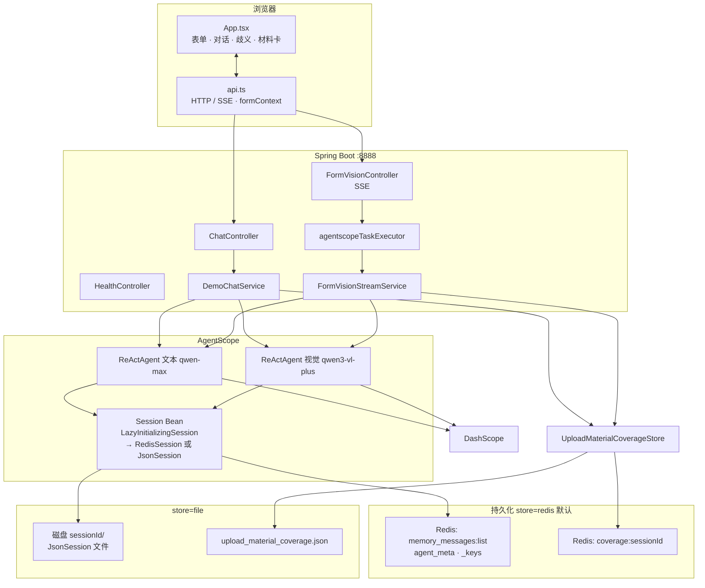
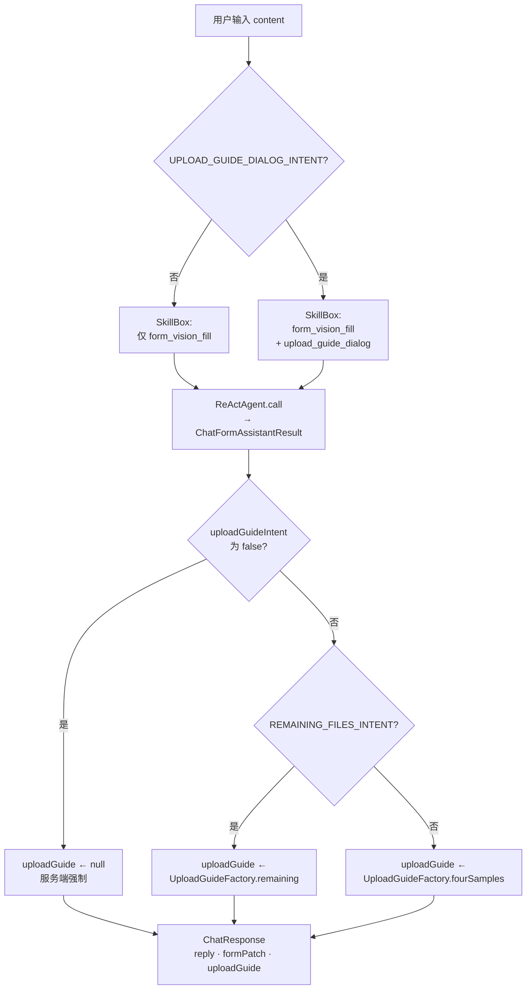
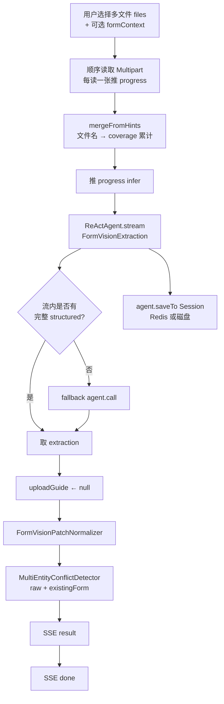
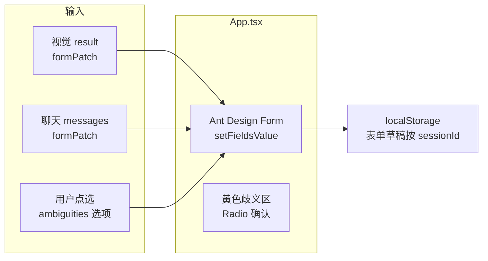
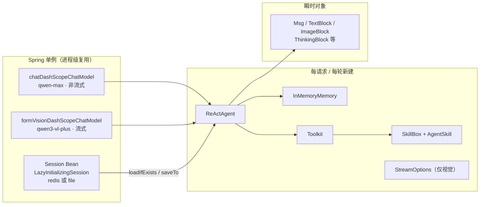

# multimodal-demo（重构版）

企业工商与资质类 **结构化表单** 演示应用：左侧 **AgentScope Java** 智能对话（含多图视觉流式识别），右侧 **Ant Design** 表单；模型输出经 **camelCase `form_patch`** 回填，支持 **多主体营业执照歧义** 与 **材料清单卡片**（`upload_guide`）。

> 本目录为相对 `mutilmodel-old` 的重构副本，变更摘要见 [REFACTOR.md](REFACTOR.md)。技能正文已精简，材料卡由 `UploadGuideFactory` 服务端生成。

**专题文档**

| 文档 | 内容 |
|------|------|
| [README-MEMORY-SESSION.md](README-MEMORY-SESSION.md) | Memory vs Session、JsonSession / Redis、前端 localStorage 与 formContext 对照 |
| [README-REDIS.md](README-REDIS.md) | Redis Session 架构、键结构、Lettuce 选型、本机数据样例与排查 |
| [README-VISION-FILL.md](README-VISION-FILL.md) | **form_vision_fill**：证照识别 → 表单回填、歧义、扩展新字段/新证照 |

---

## 目录

- [功能概览](#功能概览)
- [架构流程图](#架构流程图)
- [核心功能流程图](#核心功能流程图)
- [技术栈与版本](#技术栈与版本)
- [仓库结构](#仓库结构)
- [环境要求](#环境要求)
- [配置说明](#配置说明)
- [运行方式](#运行方式)
- [会话与安全](#会话与安全)
- [HTTP API](#http-api)
- [多图视觉 SSE 协议](#多图视觉-sse-协议)
- [Agent、技能与业务规则](#agent技能与业务规则)
- [AgentScope 核心类：生命周期与取舍](#agentscope-核心类生命周期与取舍)
- [视觉结果后处理](#视觉结果后处理)
- [材料四类与样图资源](#材料四类与样图资源)
- [前端要点](#前端要点)
- [构建与测试](#构建与测试)
- [排错与注意事项](#排错与注意事项)

---

## 功能概览

| 能力 | 说明 |
|------|------|
| **文本对话** | 用户输入自然语言；模型返回 `reply`，可选 `form_patch`（表单键值子集），可选 `upload_guide`（材料卡）。阻塞式 HTTP，直至本轮模型结束。 |
| **多图视觉识别** | 对话区底部上传多张图片；服务端 **SSE** 推送读取进度、推理片段、流式摘要文本，最后下发 **`result`** JSON（`form_patch`、`ambiguities`、`reply`）。 |
| **歧义确认** | 多营业执照等不同主体冲突时，结构化 **`ambiguities`**；前端在表单上方展示选项，用户点选后再写入字段。 |
| **材料清单卡** | 由 `upload_guide` 驱动；与 **技能** 及 **服务端意图/覆盖推断** 对齐（见下文）。 |
| **会话持久化** | 默认 **`store=redis`**（`RedisSession` + Lettuce）；无 Redis 时可 **`store=file`**（`JsonSession` 落盘）。文本与视觉 Agent 共用同一 `Session` Bean 与 `sessionId`。 |
| **材料覆盖推断** | 基于 **上传文件名关键词** 累计四类证照是否「出现过」；`store=redis` 时写入 Redis 键 `coverage:{sessionId}`，`store=file` 时写入 `upload_material_coverage.json`（**非**图像内容识别）。 |
| **多轮上传歧义** | 视觉请求可附带 **`formContext`**（当前表单 JSON）；多主体检测合并「已填报」与本轮识别结果，生成 `ambiguities`。详见 [README-VISION-FILL.md](README-VISION-FILL.md)。 |

---

## 架构流程图

下图从**用户浏览器 → Spring → AgentScope → DashScope → Session 存储（Redis 或磁盘）**分层展示主要组件（省略异常路径）。



**读图要点**

- **文本**与**视觉**使用**不同** `DashScopeChatModel` Bean。  
- **视觉**在 **`agentscopeTaskExecutor`** 中异步执行；Controller 只返回 `SseEmitter`。  
- **`Session`** 按 `agentscope.session.store` 装配；Redis 模式下 **Agent 状态**与 **coverage 侧车** 共用 `key-prefix`，但走不同客户端（Lettuce `RedisSession` vs Spring `StringRedisTemplate`）。详见 [README-REDIS.md](README-REDIS.md)。

---

## 核心功能流程图

### 1. 文本对话（阻塞 HTTP）



与 `DemoChatService` 一致：先完成 **`call`**，再按 **`uploadGuideIntent` / `remainingFilesIntent`** 覆盖或清空 **`uploadGuide`**。

### 2. 多图视觉识别（SSE）



### 3. 表单回填与歧义交互（前端闭环）



---

## 技术栈与版本

| 组件 | 说明 |
|------|------|
| **JDK** | 17（`pom.xml` → `java.version`） |
| **Spring Boot** | 3.3.6 |
| **AgentScope Java** | `agentscope`、`agentscope-extensions-session-redis` **1.0.12**（见 `pom.xml`） |
| **Redis（默认会话）** | Spring Data Redis + Lettuce；可选本地 Redis（见 [README-REDIS.md](README-REDIS.md)） |
| **DashScope** | 文本 **`qwen-max`**（非流式）；视觉 **`qwen3-vl-plus`**（流式），见 `DashScopeModelConfig` |
| **前端** | React 18、TypeScript 5.6、Vite 6、Ant Design 5；开发端口 **5173**，构建产物输出到 `src/main/resources/static/` |
| **Node（可选）** | `frontend-maven-plugin` 使用 Node **v20.18.0** / npm **10.8.2**（启用 `frontend` profile 时） |

---

## 仓库结构

```
multimodal-demo/
├── pom.xml                          # Maven：Spring Boot、AgentScope、可选前端构建
├── frontend/                        # Vite + React UI
│   ├── package.json
│   ├── vite.config.ts               # 代理 /api → 后端；outDir → ../src/main/resources/static
│   └── src/
│       ├── App.tsx                  # 主界面：表单、对话、视觉 SSE、歧义、材料卡
│       └── api.ts                   # HTTP/SSE、normalizeVisionUploadGuide、sanitizeAssistantReplyDisplay
├── src/main/java/io/agentscope/demo/
│   ├── app/
│   │   ├── MultimodalDemoApplication.java
│   │   ├── agent/                   # SkillLoader、ChatIntents、AgentPrompts
│   │   ├── config/                  # DashScope、CORS、异步线程池、Session redis/file 装配
│   │   ├── session/                 # LazyInitializingSession、coverage 持久化 redis/file
│   │   ├── service/
│   │   │   ├── DemoChatService.java         # 文本对话 + 意图路由 + upload_guide 覆盖逻辑
│   │   │   ├── FormVisionStreamService.java # 多图 SSE、patch 归一、多主体冲突检测、coverage 合并
│   │   │   ├── FormVisionPatchNormalizer.java
│   │   │   └── FormVisionMultiEntityConflictDetector.java
│   │   ├── upload/                  # 文件名推断、覆盖持久化、UploadGuideFactory 构造材料卡
│   │   └── web/                     # REST：Chat、FormVision(SSE)、Health、DTO
│   └── SessionIds.java              # sessionId 白名单校验（防路径穿越）
├── src/main/resources/
│   ├── application.yml              # 端口、multipart 上限、agentscope、dashscope、logging
│   ├── skills/
│   │   ├── form_vision_fill.md      # 表单键、歧义、reply 章节骨架（不定义 upload_guide）
│   │   └── upload_guide_dialog.md   # upload_guide 白名单与卡片文案规则（仅文本意图命中时加载）
│   └── static/                      # `npm run build` 生成的前端静态资源（勿手改）
└── data/agentscope-sessions/        # store=file 时的默认会话根；store=redis 时 Agent 状态在 Redis
```

仓库中 **`FileController`** 已注释；主流程为 **`ChatController`** + **`FormVisionController` SSE**。

---

## 环境要求

- **JDK 17**、**Maven 3.8+**
- 有效 **DashScope API Key**（百炼 / 通义）
- **默认 `store=redis`**：本地需可连 Redis（如 `localhost:6379`）；无 Redis 时设 **`AGENTSCOPE_SESSION_STORE=file`**
- 前端开发可选：**Node 20+**、npm

---

## 配置说明

### 1. `application.yml`（随仓库）

| 项 | 含义 |
|----|------|
| `server.port` | 默认 **8888** |
| `spring.servlet.multipart.max-file-size` / `max-request-size` | 单文件 **50MB**、整请求 **55MB** |
| `spring.config.import` | 可选加载同目录 **`application-local.yml`**（适合放密钥，勿提交 Git） |
| `agentscope.session.store` | **`redis`**（默认）或 **`file`**；环境变量 **`AGENTSCOPE_SESSION_STORE`** |
| `agentscope.session.key-prefix` | Redis 键前缀，默认 `agentscope:multimodal-demo:` |
| `agentscope.session.file-root` | `store=file` 时会话根目录，默认 `data/agentscope-sessions`；**`AGENTSCOPE_SESSION_ROOT`** |
| `spring.data.redis.*` | `host` / `port` / `database`；密码用 **`application-local.yml`** 或 **`REDIS_PASSWORD`**（勿在默认 yml 写空 `password`） |
| `dashscope.api-key` | API Key；**务必**用 **`DASHSCOPE_API_KEY`** 或 `application-local.yml` 覆盖，**勿提交真实密钥** |
| `dashscope.vision-enable-thinking` | 视觉是否开启 extended thinking；`DashScopeProperties` 默认 `false`，仓库 `application.yml` 可能为 `true`（若遇 400 与 `thinking_budget` 相关，见[排错](#排错与注意事项)） |
| `dashscope.vision-thinking-budget` | 正整数预算；可用 **`DASHSCOPE_VISION_THINKING_BUDGET`** 覆盖 |

### 2. 推荐本地覆盖：`application-local.yml`

在项目根或工作目录放置（已在 `.gitignore` 中忽略则更安全）：

```yaml
dashscope:
  api-key: sk-your-real-key
  vision-enable-thinking: false   # 遇 400 与 thinking_budget 相关时关闭

spring:
  data:
    redis:
      host: localhost
      port: 6379
      database: 0
      password: "123456"          # 仅当 Redis 启用 requirepass 时

# 无 Redis 时取消注释：
# agentscope:
#   session:
#     store: file
```

或环境变量：

```bash
export DASHSCOPE_API_KEY=sk-your-real-key
export REDIS_HOST=localhost
export REDIS_PASSWORD=123456          # 有密码时
export AGENTSCOPE_SESSION_STORE=redis # 或 file
```

完整 Redis 说明见 [README-REDIS.md](README-REDIS.md)；示例文件见根目录 **`application-local.yml.example`**。

### 3. Vite 代理

`frontend/vite.config.ts` 中 **`VITE_PROXY_TARGET`** 默认 `http://localhost:8888`，与 Spring 默认端口一致。

---

## 运行方式

### A. 仅后端 + 已构建前端（默认 `frontend.skip=true`）

若 `src/main/resources/static/` 已有构建产物：

```bash
mvn -q spring-boot:run
```

浏览器打开：`http://localhost:8888/`（静态页由 Spring 托管）。

### B. 一条命令：Maven 内嵌安装 Node 并构建前端再运行

```bash
mvn -q -Pfrontend spring-boot:run
```

`-Pfrontend` 将 `frontend.skip` 设为 `false`，触发 `frontend-maven-plugin` 的 `npm install` 与 `npm run build`。

### C. 前后端分离开发（热更新）

1. 终端一：`mvn spring-boot:run`（8888）  
2. 终端二：`cd frontend && npm install && npm run dev`（5173）  

浏览器访问 **http://localhost:5173**；`/api` 由 Vite 代理到 8888。`WebConfig` 已对 `http://localhost:5173` 与 `127.0.0.1:5173` 放开 **`/api/**`** 的 CORS。

---

## 会话与安全

- 所有需 `sessionId` 的 API 路径参数均经 **`SessionIds.requireSafeSessionId`**：
  - 非空、最大长度 **128**
  - **仅允许** `[a-zA-Z0-9_-]+`
  - **禁止** `..`、`/`、`\`
- 前端通常使用 **UUID** 作为会话 id；请勿传入任意文件路径片段。

---

## HTTP API

| 方法 | 路径 | 说明 |
|------|------|------|
| `GET` | `/api/health` | 存活探测：`status`、`sessionStore`；`store=redis` 时含 `redis`（`UP` / `DOWN` / `DEGRADED`） |
| `POST` | `/api/sessions/{sessionId}/messages` | 文本对话；JSON body **`ChatRequest`**（`content`） |
| `POST` | `/api/sessions/{sessionId}/vision/form-stream` | 多图视觉 SSE；`multipart`：**`files`**（可重复）、可选 **`formContext`**（当前表单 JSON 字符串） |

### `POST .../messages` 响应体（`ChatResponse`）

- **`reply`**：字符串，助手主文案  
- **`formPatch`**：对象或 `null`，camelCase 键 → 表单值  
- **`serverTime`**：服务端时间  
- **`uploadGuide`**：对象或 `null`，材料卡（见 DTO `UploadGuideDto` / 前端 `VisionUploadGuide`）

### `ChatRequest`

```json
{ "content": "用户输入的纯文本" }
```

---

## 多图视觉 SSE 协议

- **Controller**：`FormVisionController`；`SseEmitter` 超时 **30 分钟**；**禁止**在 Servlet 线程内同步执行 `runAnalysis`（由 **`agentscopeTaskExecutor`** 异步执行）。
- **Content-Type**：`text/event-stream`；每条事件为 SSE **`data:`** 后接 **单行 JSON**（前端按行 `JSON.parse`）。

### 事件 `type` 一览

| `type` | 典型字段 | 说明 |
|--------|-----------|------|
| `progress` | `phase`：`load_image` \| `infer`；`done`、`total`、`label`、`fileName`（读图阶段） | 读图进度或进入推理阶段提示 |
| `thinking` | `delta` | 推理片段增量（来自 `ThinkingBlock` 等） |
| `assistant_text` | `delta` | 汇总/结果通道的文本增量 |
| `result` | `reply`、`formPatch`、`ambiguities`、`uploadGuide` | **最终结构化结果**；其中 **`uploadGuide` 服务端固定为 `null`**（视觉链路不产出材料卡） |
| `done` | — | 流正常结束 |
| `error` | `message` | 错误说明；连接随后关闭 |

流结束若仍无完整结构化体，`FormVisionStreamService` 会 **fallback** 再 `agent.call` 一次；仍失败则返回占位 `reply`。

---

## Agent、技能与业务规则

### 共同基础

- **`ReActAgent`** + **`SkillBox`** 注册 classpath 技能；结构化输出类型由路由区分（文本：`ChatFormAssistantResult`；视觉：`FormVisionExtraction`）。
- **`Session`**（`RedisSession` 或 `JsonSession`）：`agent.loadIfExists` / `saveTo`；Redis 键结构见 [README-REDIS.md](README-REDIS.md)。  
- 各核心类的**是否单例、为何这样拆**见下节 **[AgentScope 核心类：生命周期与取舍](#agentscope-核心类生命周期与取舍)**。

### 技能一：`form_vision_fill`（`src/main/resources/skills/form_vision_fill.md`）

- **职责**：`form_patch` 的 **camelCase 键**、日期 **ISO-8601**、**`ambiguities`**（视觉）、**`reply`** 的 **【】四段章节骨架**（识别概要 / 已抽取字段 / 待确认·歧义 / 未覆盖说明）。
- **不职责**：不定义 **`upload_guide`** JSON；不在此技能中加载上传引导类规则。

### 技能二：`upload_guide_dialog`（精简 Markdown）

- **职责**：`reply` 中与上传/缺件/操作说明相关的话术（见 `skills/upload_guide_dialog.md`）。
- **加载时机**：`ChatIntents.uploadGuide(text)` 为真时由 `SkillLoader.uploadGuideDialog()` 注册。

### 文本对话中 `upload_guide`（`UploadGuideFactory`）

1. **未命中**上传引导意图：`uploadGuide = null`。
2. **命中**且为「仍缺哪些」类追问：`UploadGuideFactory.remaining(coverage)`。
3. **其它**上传引导意图：`UploadGuideFactory.fourSamples()`（固定四证示意卡）。

系统提示在「仍缺文件」分支会把 **`UploadMaterialCoverageStore.readMerged`** 的已推断/未推断证照中文列表注入模型，便于 **`reply`** 与卡片一致。

### 视觉链路 `upload_guide`（`FormVisionStreamService`）

- **不注册** `upload_guide_dialog`。
- 用户消息与 **sysPrompt** 明确要求：**仅** `form_vision_fill`；**`upload_guide` 恒为 null**。
- 在发出 `result` 前执行 **`extraction.uploadGuide = null`**，防止模型偶发输出材料卡。

### 视觉上传与覆盖文件

- 每张图读完后 **`uploadMaterialCoverageStore.mergeFromHints(safeId, names)`**。
- **`MaterialFilenameInference`** 推断四类 **`MaterialSampleIds`**，合并写入 coverage 侧车（Redis 或 `upload_material_coverage.json`），与 OCR 结果独立。
- 可选 **`formContext`**：前端上传前序列化当前表单；**`FormVisionMultiEntityConflictDetector`** 将「已填报」与本轮 patch 一并参与歧义（标签含 **已填报（当前表单）**）。

---

## AgentScope 核心类：生命周期与取舍

本节说明 **Spring Web 主路径**（`DemoChatService`、`FormVisionStreamService`）如何装配 AgentScope；**CLI 示例**（`src/main/java/io/agentscope/demo/demos/*`）多为 `main` 里临时 `new`，不经过 Spring Bean，但类名与用法一致。

### 总体策略（三层）



| 层次 | 含义 | 本项目做法 |
|------|------|------------|
| **基础设施单例** | 模型客户端、会话存储 | `DashScopeChatModel` ×2、`Session` Bean 1 个（内部 redis/file） |
| **请求级 Agent** | 一轮 HTTP/SSE 对应一次推理上下文 | 每次 `chat` / `runAnalysis` **新建** `ReActAgent` + `InMemoryMemory` + `SkillBox` |
| **跨请求状态** | 同一 `sessionId` 的多轮记忆 | 不靠长驻 Agent，靠 **`Session` 持久化**（Redis 或磁盘）+ `loadIfExists` / `saveTo` |

### 核心类对照表

| AgentScope 类 | 主路径使用位置 | 是否单例 | 生命周期 / 说明 |
|---------------|----------------|----------|------------------|
| **`DashScopeChatModel`** | `DashScopeModelConfig` → 注入 `DemoChatService` / `FormVisionStreamService` | **是**（2 个 Bean） | `chatDashScopeChatModel`：`qwen-max`、`stream=false`；`formVisionDashScopeChatModel`：`qwen3-vl-plus`、`stream=true`。构建时内嵌 `DashScopeChatFormatter`、`GenerateOptions`（视觉开思考时带 `thinkingBudget`）。 |
| **`DashScopeChatFormatter`** | `DashScopeSupport` 构建 Model 时 | 随 Model **单例** | 不单独注册 Bean；与对应 Model 绑定，保证请求/响应格式一致。 |
| **`GenerateOptions`** | `DashScopeSupport.visionModel(...)` | 随视觉 Model **单例** | 仅在 `vision-enable-thinking=true` 时设置 `thinkingBudget`；文本 Model 使用空 options。 |
| **`Session`** | `AgentscopeSessionConfiguration` 按 `store` 装配；两 Service 注入 | **是** | **redis**：`RedisSession` + Lettuce，键 `{keyPrefix}{sessionId}:…`；**file**：`JsonSession` + `file-root`。Redis 用 `LazyInitializingSession` 延迟首连。 |
| **`ReActAgent`** | 每轮 `DemoChatService#chat`、`FormVisionStreamService#runAnalysis` | **否** | `ReActAgent.builder()...build()`；文本 `maxIters=8`，视觉 `maxIters=12`；`structuredOutputReminder(PROMPT)`。 |
| **`InMemoryMemory`** | 同上，挂到 Agent | **否** | 每轮 **全新** 内存；历史来自 **`loadIfExists(jsonSession)`** 恢复的 Agent 状态，而非复用上一个 Java 堆里的 Memory 实例。 |
| **`Toolkit`** | 构建 `SkillBox` 前 `new Toolkit()` | **否** | 每轮新建；当前技能以 Markdown 注入为主，工具调用面较窄。 |
| **`SkillBox`** | `SkillLoader.formVisionFill()`；文本命中意图时再 `uploadGuideDialog()` | **否** | 每轮按路由注册不同技能集合；视觉链路**仅** `form_vision_fill`。 |
| **`AgentSkill`** | `*SkillSupport.load()` 读 classpath `skills/*.md` | **否**（对象）/ **是**（内容） | 每次 `load()` 新建 `AgentSkill` 实例，正文来自静态资源；未做跨请求缓存，换技能组合时无脏状态。 |
| **`Msg`** | `Msg.builder()` 构造用户/助手消息 | **否** | 文本：单 `TextBlock`；视觉：说明 `TextBlock` + 多 `ImageBlock`（`Base64Source`）。 |
| **`TextBlock` / `ImageBlock` / `ThinkingBlock` / `Base64Source`** | 组装 `Msg`；SSE 从 `ThinkingBlock` 抽推理 | **否** | 纯数据块；视觉读图阶段在 JVM 内持有多张 `byte[]` 再 Base64 编码进 `ImageBlock`。 |
| **`StructuredOutputReminder`** | Agent builder | **枚举常量** | `StructuredOutputReminder.PROMPT`：在提示中约束 JSON 形状（`ChatFormAssistantResult` / `FormVisionExtraction`）。 |
| **`StreamOptions`** | `FormVisionStreamService` 流式推理 | **否** | 订阅 `REASONING`、`SUMMARY`、`AGENT_RESULT`、`HINT`；`incremental=true` 映射为 SSE `thinking` / `assistant_text`。 |
| **`EventType`** | `agent.stream(...).doOnNext` | **否** | 框架事件枚举；用于分支推送 SSE，不持久化。 |

**非 AgentScope、但与运行时强相关**

| 类 | 单例 | 作用 |
|----|------|------|
| **`agentscopeTaskExecutor`**（`AgentscopeAsyncConfig`） | **是** | 视觉 SSE：Controller 立即返回 `SseEmitter`，`runAnalysis` 在线程池执行（内部 `Flux.blockLast`，禁止占 Servlet 线程）。 |
| **`UploadMaterialCoverageStore`** | **是**（`@Component`） | 按 `sessionId` 写 coverage 侧车（Redis 或文件）；**不**进入 AgentScope `memory_messages` 格式。 |

### 为何这样用（设计原因）

1. **`DashScopeChatModel` 单例**  
   - 模型名、API Key、`stream`、是否开思考等属于**进程级配置**，构建成本高、无会话语义。  
   - 文本与视觉**拆两枚 Bean**：避免流式/非流式、不同 `modelName` 互相污染。

2. **`Session` 单例 + `ReActAgent` 每请求新建**  
   - `loadIfExists` / `saveTo` 把 Agent 状态写入 Redis 或 `{fileRoot}/{sessionId}/`。  
   - **每请求新建 Agent** 避免同 session 并发争用堆内状态；历史靠 Session 存储合并。  
   - 文本与视觉**共用同一 `Session` Bean 与 `sessionId`**，可先对话后传图共享上下文。

3. **`InMemoryMemory` 每轮新建**  
   - 视觉链路注释写明：**不要求跨轮对话记忆**，每轮 vision 用干净 memory，避免上一轮 OCR 残留干扰；持久化仍 `saveTo` 供后续文本轮次使用。  
   - 文本链路同样每轮 `new InMemoryMemory()`，依赖 `loadIfExists` 恢复而非堆内单例 Memory。

4. **`SkillBox` / `Toolkit` 每轮新建 + 条件注册技能**  
   - `upload_guide_dialog` **仅**在 `UPLOAD_GUIDE_DIALOG_INTENT` 命中时注册，避免与 `form_vision_fill` 抢上下文。  
   - 视觉请求**强制不注册** upload 技能，并在后处理里 `uploadGuide = null`。

5. **结构化输出双通道（视觉）**  
   - 主路径：`agent.stream(..., FormVisionExtraction.class)`，从 `AGENT_RESULT` 等事件取 `structuredData`。  
   - 兜底：流结束仍无结构化体时再 `agent.call(...).block()`，兼容部分模型在流式通道不完整挂结构化字段的行为。

### 优点

| 优点 | 说明 |
|------|------|
| **配置集中** | Key、模型名、思考预算只在 `application.yml` + `DashScopeModelConfig` / `DashScopeSupport` 维护。 |
| **文本/视觉隔离** | 两枚 Model Bean，互不改 `stream` 或 `modelName`。 |
| **并发更安全** | 无全局 `ReActAgent`；同 session 并发请求不易共享可变 Agent 状态（仍需注意同 session 并发写盘的竞态，当前产品假设单用户单页）。 |
| **路由灵活** | 每轮按需组装 `SkillBox`、系统提示与结构化 DTO 类型。 |
| **可观测** | 视觉 SSE 把 `EventType` 映射为 `progress` / `thinking` / `assistant_text`，便于前端展示。 |
| **与 Spring 契合** | 长连接异步 + 阻塞式 `call`/`blockLast` 分工明确。 |

### 缺点与注意点

| 缺点 / 风险 | 说明 |
|-------------|------|
| **每请求装配开销** | 每次 `new` Agent、Memory、Toolkit、读 classpath 技能 Markdown；高 QPS 时需关注 CPU 与类加载（可考虑缓存 `AgentSkill` 实例，当前未做）。 |
| **Memory 与 Session 语义易混** | 见 [README-MEMORY-SESSION.md](README-MEMORY-SESSION.md)；堆内 `InMemoryMemory` 每轮新建，历史来自 Session。 |
| **同 session 并发写入** | 多标签同 `sessionId` 并发 `saveTo` 可能覆盖；演示假设单页单会话。 |
| **Redis 双连接** | AgentScope Lettuce 与 Spring `StringRedisTemplate` 可能各一条连接（见 [README-REDIS.md](README-REDIS.md) 选型说明）。 |
| **阻塞在线程池** | 视觉 `blockLast(12min)`、文本 `block(3min)` 占 worker 线程；依赖有界池与 SSE 超时（30min）。 |
| **双模型成本** | 文本、视觉各调一次 DashScope；无法靠「单 Agent 单例」合并调用。 |
| **CLI 与 Web 不一致** | `demos/*` 在 `main` 中手写装配，**不**注入 Spring Bean；读代码时需区分入口。 |

### CLI 示例包（`io.agentscope.demo.demos`）差异摘要

| 示例类 | 额外 AgentScope 能力 | 与 Web 差异 |
|--------|----------------------|-------------|
| `SessionPersistenceDemo` | `JsonSession` + `saveTo` / `load` | 与 Web 会话思路一致，无 Spring |
| `StructuredOutputDemo` | `StructuredOutputReminder` + 结构化 DTO | 同 Web 文本链路思路 |
| `VisionDemo` | 多模态 `ImageBlock` | 同 Web 视觉，但无 SSE |
| `SkillDemo` | `SkillBox` + classpath 技能 | 同技能加载方式 |

### 相关配置与源码入口

| 主题 | 类 / 文件 |
|------|-----------|
| Model Bean | `DashScopeModelConfig`, `DashScopeSupport`, `DashScopeProperties` |
| Session Bean | `AgentscopeSessionConfiguration`, `AgentscopeRedisSessionConfiguration`, `AgentscopeFileSessionConfiguration`, `AgentscopeProperties` |
| 文本 Agent 装配 | `DemoChatService` |
| 视觉 Agent 装配 + 流 | `FormVisionStreamService`, `FormVisionController` |
| 技能封装 | `SkillLoader`, `ChatIntents`, `AgentPrompts` |
| 结构化 DTO | `ChatFormAssistantResult`, `FormVisionExtraction` |

---

## 视觉结果后处理

在 SSE 下发 **`result`** 之前，对 **`FormVisionExtraction`** 做：

1. **`FormVisionPatchNormalizer.normalize`**  
   - 将模型输出的别名键、错误前缀键等映射到与前端 **`Form.Item` `name`** 一致的 **`CANONICAL_KEYS`** 白名单。  
   - 剔除白名单外字段，避免 `setFieldsValue` 静默丢键。

2. **`FormVisionMultiEntityConflictDetector.apply(extraction, raw, existingForm)`**  
   - 在归一化 **之后** 执行；`existingForm` 来自 multipart **`formContext`**（经 `FormVisionFormContextSupport` 归一化）。多证互斥或「已填报 vs 本轮识别」不一致时，剔除相关 `form_patch` 键并填充 **`ambiguities`**。

---

## 材料四类与样图资源

与 **`MaterialSampleIds`**、`upload_guide_dialog`、前端 **`frontend/public/samples/`** 对齐：

| `sample_image_id` | 中文全称（卡片 `title`） | 示意文件（构建后由静态资源提供） |
|---------------------|---------------------------|-----------------------------------|
| `BUSINESS_LICENSE` | 营业执照 | `samples/business-license.png` |
| `ID_CARD_FRONT` | 身份证人像面 | `samples/id-card-front.png` |
| `ROAD_TRANSPORT_PERMIT` | 道路危险货物运输许可证 | `samples/road-transport-permit.png` |
| `SAFETY_PRODUCTION_PERMIT` | 危险化学品经营许可证 | `samples/safety-production-permit.png` |

前端 **`api.ts`** 中：

- **`normalizeVisionUploadGuide`**：校验 id、去重、在特定 `card_title` / 条数条件下 **补全为四条** `missing_items` 等（与产品「首次四卡」体验对齐）。
- **`sanitizeAssistantReplyDisplay`**：展示前移除 Markdown 图片语法、常见「（如适用）」等，减少裂图与冗余后缀。
- **`resolveSampleImageUrl`**：将 `sample_image_id` 映射为上述路径。

UI 上缩略图叠加 **「样图」** 角标（见 `App.css`）。

---

## 前端要点

- **入口**：`frontend/src/main.tsx` → `App.tsx`。
- **会话 id**：页面加载时用 **`crypto.randomUUID()`** 生成一次，整页生命周期内固定；API 路径均带该 id。表单草稿通过 **`localStorage`** 键前缀 `FORM_STORAGE_PREFIX + sessionId` 读写（见 `App.tsx`），**并非**把 sessionId 单独持久化为另一键名。
- **视觉**：`postVisionFormStream` 附带 **`formContext`**（当前表单快照）；SSE 解析 `progress` / `thinking` / `result`；`result` 后应用 `formPatch`、`ambiguities`；多主体时按 `ambiguities` 键清空表单字段（见 `api.ts`）。
- **聊天**：`postJson` 调 `messages`；若有 `uploadGuide` 则经 `normalizeVisionUploadGuide` 后渲染 **`UploadGuideCardSection`**。

---

## 构建与测试

```bash
# Java 编译
mvn -q compile -DskipTests

# 单元测试
mvn -q test

# 仅前端类型检查与生产构建
cd frontend && npm ci && npm run build
```

与 **`FormVisionPatchNormalizer`**、**`FormVisionMultiEntityConflictDetector`** 等相关的测试位于 `src/test/java/...`。

---

## 排错与注意事项

1. **DashScope API Key**  
   未配置或无效时，应用可能启动失败或调用报错；请使用 **`DASHSCOPE_API_KEY`** 或 `application-local.yml`。

2. **视觉 extended thinking**  
   `DashScopeModelConfig` 注释说明：当前视觉 Bean 使用 **`qwen3-vl-plus`**；部分模型与 **正 `thinking_budget`** 组合可能返回 **400**。若出现类似错误，将 **`dashscope.vision-enable-thinking`** 设为 **`false`** 或调整预算，并阅读 `DashScopeSupport` / 官方文档。

3. **`sessionId` 400**  
   检查是否含非法字符或路径片段。

4. **SSE 在开发代理下缓冲**  
   Vite 已对 `text/event-stream` 响应设置 **`x-accel-buffering: no`** 等，仍异常时可直连 8888 对比。

5. **材料卡与「仍缺」不一致**  
   「还缺」类追问以 **coverage 侧车**（Redis 或 `upload_material_coverage.json`，文件名推断）为准，而非模型口头描述。

6. **Redis 连接失败**  
   - 检查 `spring.data.redis` 与密码；`GET /api/health` 查看 `redis` 字段。  
   - 临时无 Redis：`AGENTSCOPE_SESSION_STORE=file`。  
   - 详见 [README-REDIS.md](README-REDIS.md)。

---

## 相关类速查

| 主题 | 主要类 / 文件 |
|------|----------------|
| 文本对话 | `DemoChatService`, `ChatController`, `ChatFormAssistantResult`, `ChatResponse` |
| 视觉 SSE | `FormVisionStreamService`, `FormVisionController`, `FormVisionExtraction` |
| 技能加载 | `SkillLoader` |
| 技能正文 | `src/main/resources/skills/*.md` |
| Patch / 歧义 | `FormVisionPatchNormalizer`, `FormVisionMultiEntityConflictDetector` |
| 覆盖与材料卡 | `UploadMaterialCoverageStore`, `MaterialFilenameInference`, `UploadGuideFactory`, `MaterialSampleIds` |
| 模型 Bean | `DashScopeModelConfig`, `DashScopeProperties` |
| 会话 / Redis | `AgentscopeProperties`、`AgentscopeSessionConfiguration`、[README-REDIS.md](README-REDIS.md)、[README-MEMORY-SESSION.md](README-MEMORY-SESSION.md) |
| formContext | `FormVisionFormContextSupport`、`FormVisionController`、`frontend/src/api.ts` |
| AgentScope 生命周期 | 见上文 **[AgentScope 核心类：生命周期与取舍](#agentscope-核心类生命周期与取舍)** |

---

维护 README 时，若行为与代码不一致，**以 Java / TypeScript / `application.yml` 为准**，并同步专题文档与本表。
