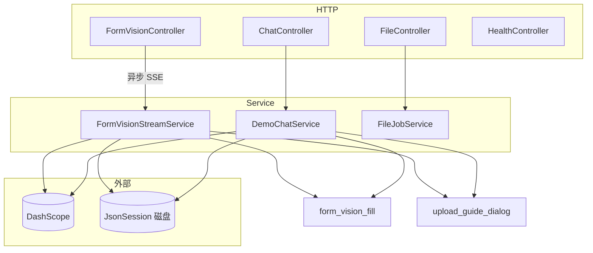

# `io.agentscope.demo.app` 模块说明

本包为 **multimodal-demo** 的 Spring Boot 应用层：基于 **AgentScope**（`ReActAgent`、Skill、`JsonSession`）与 **阿里云 DashScope**（`qwen-max` / `qwen-vl-max`），对外提供 **会话内文本对话**、**多图表单视觉识别（SSE 流式）** 等 HTTP API，并与前端 Ant Design 表单字段（camelCase）对齐。

> 根入口类：`MultimodalDemoApplication`（扫描 `io.agentscope.demo` 全包）。  
> 同仓库前端入口：`frontend/src/App.tsx`；视觉 SSE 消费：`frontend/src/api.ts`；样式：`frontend/src/App.css`。

---

## 1. 包内目录结构

| 路径 | 职责 |
|------|------|
| `MultimodalDemoApplication.java` | Spring Boot 启动、启用调度、`ApplicationRunner` 打 `[boot]` 锚点日志 |
| `config/` | Bean 与外部化配置：DashScope 模型、磁盘 `JsonSession`、SSE 用线程池、CORS 等 |
| `web/` | REST 控制器与统一异常；`web/dto/` 为请求/响应与结构化输出 DTO |
| `service/` | 业务实现：视觉流、文本对话、（演示用）单文件假任务 |
| `agent/` | 从 classpath 加载 `form_vision_fill` 与 `upload_guide_dialog` 技能，供视觉与文本链路注册到 `SkillBox` |

**非本包但强相关**：

- `io.agentscope.demo.SessionIds`：对 URL 中的 `sessionId` 做安全校验（单路径段、防 `..` 等），供 `JsonSession` 落盘目录名。
- `classpath:/skills/form_vision_fill.md`：表单字段与歧义约定。  
- `classpath:/skills/upload_guide_dialog.md`：上传操作说明、`upload_guide` 材料卡与白名单。

---

## 2. 架构与依赖关系（简图）

---

## 3. 核心业务流程

### 3.1 多图 + 表单视觉（主链路）

1. 客户端 `POST /api/sessions/{sessionId}/vision/form-stream`，`multipart/form-data`，字段名 `files` 可重复多图。
2. `FormVisionController` 先返回 `SseEmitter`（长超时），在 **`agentscopeTaskExecutor`** 中异步调用 `FormVisionStreamService#runAnalysis`，避免阻塞 Servlet 线程。
3. **服务内阶段概要**  
   - `SessionIds.requireSafeSessionId` → 过滤空 part → 顺序 `getBytes` 读图。  
   - 每读一张仍推送 `progress`（`phase=load_image`，`done/total/fileName`）：便于排障与旧版 UI；**主进度语义以模型流为准的实现见前端**（见 §10）。  
   - 推送 `phase=infer` 后构造多模态 `Msg`（任务说明 `TextBlock` + 多图 `ImageBlock` Base64）。  
   - 注册技能 **`form_vision_fill`** 与 **`upload_guide_dialog`**，构建 `ReActAgent`，`loadIfExists(jsonSession, safeId)`。  
   - `agent.stream(..., StreamOptions, FormVisionExtraction.class)`：`doOnNext` 将 AgentScope 事件映射为 SSE JSON（见下表「推理字段」）。  
   - 流结束若仍无结构化体 → **兜底** `agent.call(userMsg, FormVisionExtraction.class)`。  
   - 发送 `result`，`saveTo`，`done`，`emitter.complete()`；异常路径 `error` + `completeWithError`。  
4. **推理事件与 `ThinkingBlock`（重要）**  
   - `EventType.REASONING` 的增量内容在 **`Msg` 内的 `ThinkingBlock#getThinking()`**，而不是仅靠 `Msg#getTextContent()`。  
   - `FormVisionStreamService` 使用 **`reasoningDeltaOrText(Msg)`**：优先聚合 `ThinkingBlock`，否则回退 `getTextContent()`，再序列化为 SSE `type: "thinking", delta: "..."`。  
   - 若模型或配置不产生推理块（例如部分视觉模型未开 compatible 的 extended thinking），前端「推理过程」仍可能为空，属上游能力限制。

**SSE 事件类型（JSON，每帧 `data: {...}\n\n`）**

| `type` | 含义 |
|--------|------|
| `progress` | 阶段与计数：`phase` 如 `load_image` / `infer`，`done` / `total`，可选 `label` / `fileName` |
| `thinking` | 推理片段增量 `delta`（来自 `ThinkingBlock` 聚合） |
| `assistant_text` | 面向用户的说明文本增量 `delta`（`SUMMARY` / `AGENT_RESULT` 的文本） |
| `result` | 最终：`reply`、`formPatch`、`ambiguities`、`uploadGuide` |
| `done` | 正常结束 |
| `error` | 可读错误 `message` |

### 3.2 会话内文本对话

1. `POST /api/sessions/{sessionId}/messages`，JSON `ChatRequest`。  
2. `DemoChatService`：加载 **`form_vision_fill`** 与 **`upload_guide_dialog`** → `ReActAgent` → `loadIfExists` → `call(..., ChatFormAssistantResult.class)` → `saveTo`。  
3. 返回 `ChatResponse`：`reply` + 可选 `formPatch` + 可选 `uploadGuide`；异常在业务层吞掉为可读文案，HTTP 200。日志：`[chat]`、`[chat-http]`。

### 3.3 演示：单文件「解析任务」

- 与 AgentScope 视觉主链路无关；内存模拟进度。  
- `POST /api/files/analyze`、`GET /api/files/{jobId}`。日志：`[file-demo]`、`[file-job]`。

### 3.4 其它

- `GET /api/health`：`{"status":"UP"}`。  
- `ApiExceptionHandler`：400 / 413 → `ProblemDetail`，并打 `[api]` 日志。

---

## 4. 数据与持久化

- **会话**：`JsonSession` 根目录 `agentscope.session-root`（默认 `data/agentscope-sessions`，可用 `AGENTSCOPE_SESSION_ROOT`）。  
- **结构化 DTO**  
  - 视觉：`FormVisionExtraction`（`form_patch` / `ambiguities` / `reply`）。  
  - 对话：`ChatFormAssistantResult`（`form_patch` / `reply`）。  
- **歧义**：`AmbiguousFieldDto` + `AmbiguousOptionDto`；前端对 `field_key` 做规范化与合并（与可见 `Form.Item` 的 `name` 对齐），避免选择后不回填。

---

## 5. 配置要点（`src/main/resources/application.yml`）

| 前缀 / 项 | 说明 |
|-----------|------|
| `dashscope.api-key` | 必填；推荐环境变量 `DASHSCOPE_API_KEY` |
| `dashscope.vision-enable-thinking` | 视觉 extended thinking；**qwen-vl-max 默认 false**，否则易 400 |
| `dashscope.vision-thinking-budget` | 仅 thinking 开启时生效 |
| `agentscope.session-root` | `JsonSession` 根路径 |
| `spring.servlet.multipart.*` | 多图上传大小上限 |
| `logging.level.io.agentscope.demo.app` | 可设为 `DEBUG`（含技能加载 `[skill]` 等） |

本地可用 `optional:file:./application-local.yml` 覆盖敏感项（勿提交仓库）。

---

## 6. Web 与并发

- **CORS**：`WebConfig` 对 `/api/**` 放行 Vite 开发源（`5173`）；生产按域名收紧。  
- **线程池**：`agentscopeTaskExecutor`（`AgentscopeAsyncConfig`）承载视觉长任务。

---

## 7. 模型 Bean（`DashScopeModelConfig`）

| Bean 名 | 用途 | 模型 |
|---------|------|------|
| `chatDashScopeChatModel` | 文本 `call` | `qwen-max` |
| `formVisionDashScopeChatModel` | 多图 `stream` | `qwen-vl-max`（流式；thinking 受 `DashScopeProperties` 约束） |

启动时会打 `[dashscope]` 日志标明是否开启 vision thinking。

---

## 8. 日志检索（便于回溯）

| 前缀 | 典型来源 |
|------|----------|
| `[boot]` | `MultimodalDemoApplication` |
| `[dashscope]`、`[async]` | `DashScopeModelConfig`、`AgentscopeAsyncConfig` |
| `[vision]`、`[vision-sse]` | `FormVisionStreamService`、`FormVisionController` |
| `[chat]`、`[chat-http]` | `DemoChatService`、`ChatController` |
| `[file-demo]`、`[file-job]` | `FileController`、`FileJobService` |
| `[api]` | `ApiExceptionHandler` |
| `[skill]` | `SkillLoader`（DEBUG：技能 Markdown 长度） |

---

## 9. 与前端协同（同仓库，非本 Java 包）

以下行为在 **`frontend/src/App.tsx`** / **`App.css`** 实现，与后端协议对照阅读即可。

| 主题 | 说明 |
|------|------|
| SSE | `postVisionFormStream`（`api.ts`）解析 `data:` JSON 行，按 `type` 更新单条助手消息的 `vision` 状态 |
| 多图 UI | 独立全宽卡片：本地 `ObjectURL` 缩略图横排；**主进度条与格位状态以模型流式输出（`thinking`+`assistant_text` 长度等）推导**，不把磁盘 `load_image` 的 `done/total` 当作「识别完成度」 |
| 推理 vs 结果 | 「推理过程」绑定 `thinkingLog`（默认展开）；「识别说明」绑定 `assistantLog` / 最终 `reply` |
| 推理展示 | 推理区不设 `max-height`，`overflow: visible`，由对话列外层滚动 |
| 识别中动效 | `.vision-thumb-cell--reading` 上光谱漂移 + 扫描线 + 横掠光束（`prefers-reduced-motion` 降级） |
| 歧义回填 | `normalizeVisionAmbiguityFieldKey`、合并歧义项、隐藏字段 `transportLegalRepresentative` 等，与表单 `name` 一致 |

静态资源：`frontend` 执行 `npm run build` 输出到 **`src/main/resources/static/`**（见 `vite.config.ts` `outDir`）。

---

## 10. 扩展阅读

- AgentScope Java：可用 MCP `user-agentscope-docs` 拉文档。  
- 前端代理：`frontend/vite.config.ts` 将 `/api` 转到后端（默认 `8888`）。
